# Routes & Pages Index — PortalAcademia

> Maps client-side routes, views, authentication guards, and end-to-end stakeholder navigation flows.  
> Base Router defined in [client/src/App.tsx](file:///client/src/App.tsx).

---

## 1. Route Registry

| Path | File Location | Access Control | Core Functionality | Dependencies |
| :--- | :--- | :--- | :--- | :--- |
| `/` | [client/src/pages/LandingPage.tsx](file:///client/src/pages/LandingPage.tsx) | **Public** | Public landing page presenting platform value propositions, 4 stakeholder cards, interactive feature highlights, and authentication portals. | `useTheme`, `useAppSelector(auth)` |
| `/auth` | [client/src/pages/AuthPage.tsx](file:///client/src/pages/AuthPage.tsx) | **Public** (Unauthenticated) | Dual-mode Sign In / Sign Up gateway supporting local email credentials, Google OAuth 2.0 redirection, and 6-digit cryptographic email OTP verification. | `useAppDispatch`, `checkAuthThunk`, `useTheme` |
| `/terms` | [client/src/pages/TermsPage.tsx](file:///client/src/pages/TermsPage.tsx) | **Public** | Public legal terms of service, platform usage conditions, and institutional compliance standards. | `Link` |
| `/privacy` | [client/src/pages/PrivacyPage.tsx](file:///client/src/pages/PrivacyPage.tsx) | **Public** | Data privacy policy outlining student telemetry protection, recruiter access rules, and institutional data governance. | `Link` |
| `/faq` | [client/src/pages/FAQPage.tsx](file:///client/src/pages/FAQPage.tsx) | **Public** | Categorized accordion-based frequently asked questions addressing students, faculty, institutions, and recruiters. | `Link` |
| `/dashboard` | [client/src/pages/dashboards/DashboardRouter.tsx](file:///client/src/pages/dashboards/DashboardRouter.tsx) | **Protected** (Authenticated) | Dynamic role resolver that queries `/api/profile/me` and routes the user directly to their respective stakeholder console (`/dashboard/student`, `/dashboard/faculty`, `/dashboard/institution`, or `/dashboard/industry`). | `useAppSelector(auth)`, `fetch(/api/profile/me)` |
| `/dashboard/student` | [client/src/pages/dashboards/StudentDashboard.tsx](file:///client/src/pages/dashboards/StudentDashboard.tsx) | **Role: Student** | Comprehensive student command center: live opportunity feed with keyword search, institutional endorsement badge indicators, quick skill verification, resume builder trigger, and embedded AI career mentor. | `Navbar`, `SkillBadge`, `TestConfirmationModal`, `SkillTestRunnerModal`, `ResumeBuilderModal`, `skillIcons` |
| `/dashboard/faculty` | [client/src/pages/dashboards/FacultyDashboard.tsx](file:///client/src/pages/dashboards/FacultyDashboard.tsx) | **Role: Faculty** | Dedicated academic dashboard featuring short-term industry sabbaticals, Faculty Development Programs (FDPs), research grant listings, and institutional endorsement indicators. | `Navbar`, `SkillBadge`, `TestConfirmationModal`, `SkillTestRunnerModal`, `skillIcons` |
| `/dashboard/institution` | [client/src/pages/dashboards/InstitutionDashboard.tsx](file:///client/src/pages/dashboards/InstitutionDashboard.tsx) | **Role: Institution** | Institutional administrative console: student credential verification queue (approve/reject certificates), cohort placement metrics, and opportunity endorsement controls. | `Navbar`, `useAppSelector(auth)`, `fetch(/api/verification/*)` |
| `/dashboard/industry` | [client/src/pages/dashboards/IndustryDashboard.tsx](file:///client/src/pages/dashboards/IndustryDashboard.tsx) | **Role: Industry** | Dual-tab corporate workspace: analytics overview (application volume, review states, role breakdowns) and posting management desk (create listings with required skills, review candidate pool with rich ATS resume modal). | `Navbar`, `SkillBadge`, `SkillInput`, `signOutThunk`, `useTheme` |
| `/ai-guide` | [client/src/pages/AiGuidePage.tsx](file:///client/src/pages/AiGuidePage.tsx) | **Protected** (Authenticated) | Interactive AI career mentor powered by Groq/LLaMA-3 with dynamic student profile injection, preset concern prompt chips, and ATS match score diagnostics. | `Navbar`, `fetch(/api/ai/chat)` |
| `/trends` | [client/src/pages/MarketTrendsPage.tsx](file:///client/src/pages/MarketTrendsPage.tsx) | **Protected** (Authenticated) | Smart analytics dispatcher that inspects user profile account type and renders either `StudentTrendsPage`, `FacultyTrendsPage`, or `InstitutionTrendsPage`. | `Navbar`, `StudentTrendsPage`, `FacultyTrendsPage`, `InstitutionTrendsPage` |
| `/trends/student` | [client/src/pages/trends/StudentTrendsPage.tsx](file:///client/src/pages/trends/StudentTrendsPage.tsx) | **Role: Student** | Macro market intelligence portal for students: 1-on-1 industry domain comparison, hiring volume timelines, skill demand rankings, and direct curriculum deficit bridges. | `Navbar`, `Recharts (AreaChart, ResponsiveContainer)` |
| `/trends/diagnosis` | [client/src/pages/trends/StudentDiagnosisPage.tsx](file:///client/src/pages/trends/StudentDiagnosisPage.tsx) | **Role: Student** | Personalized talent supply vs. market deficit diagnostic tool quantifying curriculum deficits and pinpointing exact skills needed to qualify for enterprise postings. | `Navbar`, `SkillBadge`, `Recharts (BarChart)` |
| `/trends/faculty` | [client/src/pages/trends/FacultyTrendsPage.tsx](file:///client/src/pages/trends/FacultyTrendsPage.tsx) | **Role: Faculty** | Academic research and industry collaboration intelligence: domain demand indexes, institutional sabbatical openings, and FDP domain distributions. | `Navbar`, `Recharts (AreaChart, BarChart, PieChart)` |
| `/trends/institution` | [client/src/pages/trends/InstitutionTrendsPage.tsx](file:///client/src/pages/trends/InstitutionTrendsPage.tsx) | **Role: Institution** | University cohort diagnostic observatory: curriculum deficit index curves, student skill readiness distributions, and corporate market demand benchmarks. | `Navbar`, `Recharts (BarChart)` |
| `/institution/directory` | [client/src/pages/institution/InstitutionDirectoryPage.tsx](file:///client/src/pages/institution/InstitutionDirectoryPage.tsx) | **Role: Institution** | Directory of verified enrolled students and faculty members associated with the college, filterable by department, skills, and verification status. | `Navbar`, `SkillBadge` |
| `/institution/member/:id` | [client/src/pages/institution/InstitutionMemberProfilePage.tsx](file:///client/src/pages/institution/InstitutionMemberProfilePage.tsx) | **Role: Institution** | Dedicated institutional audit view of a single affiliated student or faculty member's profile, including education records, submitted credentials, and test history. | `Navbar`, `fetch(/api/profile/student/:id)` |
| `/assessments` | [client/src/pages/SkillAssessmentsPage.tsx](file:///client/src/pages/SkillAssessmentsPage.tsx) | **Protected** (Authenticated) | Standardized technical and soft-skill MCQ examination center: trending skill test catalog, pass/fail status, automated badge certification, and test runner triggers. | `Navbar`, `SkillBadge`, `TestConfirmationModal`, `SkillTestRunnerModal` |
| `/applications` | [client/src/pages/ApplicationsTrackerPage.tsx](file:///client/src/pages/ApplicationsTrackerPage.tsx) | **Protected** (Authenticated) | Real-time application lifecycle dashboard for candidates: track progress across Applied, Under Review, Shortlisted, Technical Interview, and Offered statuses with ATS resume preview. | `Navbar`, `fetch(/api/applications/my-applications)` |
| `/profile` | [client/src/pages/ProfilePage.tsx](file:///client/src/pages/ProfilePage.tsx) | **Protected** (Authenticated) | Authenticated user's personal verified digital portfolio: headline, bio, banner presets, verified skill chips, education, certifications, and PDF resume export. | `SkillBadge`, `SkillInput`, `ProfileEditModal`, `useAppDispatch`, `useAppSelector(profile)` |
| `/profile/:id` | [client/src/pages/ProfilePage.tsx](file:///client/src/pages/ProfilePage.tsx) | **Protected** (Authenticated) | Public/Shared digital portfolio view displaying a specific user's verified credentials, project proofs, and verified skill badges. | `SkillBadge`, `ProfileEditModal`, `useAppDispatch`, `useAppSelector(profile)` |
| `/onboarding/select-type` | [client/src/pages/OnboardingSelectType.tsx](file:///client/src/pages/OnboardingSelectType.tsx) | **Onboarding Guard** | Persona gateway presenting 4 stakeholder cards (`student`, `faculty`, `institution`, `industry`) to direct new sign-ups into the correct onboarding flow. | `useAppDispatch`, `signOutThunk`, `useTheme` |
| `/onboarding/individual` | [client/src/pages/onboarding/OnboardingIndividual.tsx](file:///client/src/pages/onboarding/OnboardingIndividual.tsx) | **Onboarding Guard** | Multi-step individual profile builder: handles Student or Faculty account setup, AISHE college search/autocomplete, education records, and skill selection. | `SkillInput`, `AISHE list`, `useAppDispatch`, `checkAuthThunk` |
| `/onboarding/organization`| [client/src/pages/onboarding/OnboardingOrganization.tsx](file:///client/src/pages/onboarding/OnboardingOrganization.tsx) | **Onboarding Guard** | Multi-step organizational profile builder: handles Institution (AISHE registration, official email) or Industry (company type, website, headcount) profiles. | `AISHE list`, `useAppDispatch`, `checkAuthThunk`, `useTheme` |
| `/onboarding` | [client/src/App.tsx](file:///client/src/App.tsx) | **Onboarding Guard** | Canonical redirect route pointing directly to `/onboarding/select-type`. | `Navigate to="/onboarding/select-type"` |
| `*` | [client/src/App.tsx](file:///client/src/App.tsx) | **Public** | Catch-all wildcard redirecting unmatched URL routes back to the root landing page `/`. | `Navigate to="/"` |

---

## 2. Authentication Guards & Security Wrappers

All guards are implemented directly in [client/src/App.tsx](file:///client/src/App.tsx):

### 1. `ProtectedRoute`
- **Condition**: User must be authenticated (`isAuthenticated === true`), session check must be completed (`isInitialized === true`, `isLoading === false`), and profile must be completed (`user.isOnboarded === true`).
- **Unauthenticated Redirect**: `<Navigate to="/auth" replace />`
- **Pending Onboarding Redirect**: `<Navigate to="/onboarding/select-type" replace />`

### 2. `RoleProtectedRoute`
- **Condition**: Wraps `ProtectedRoute` logic with strict role identity matching. Resolves role from `user.role` or fetches fallback from `GET /api/profile/me`.
- **Mismatched Role Behavior**: Strictly prohibits cross-role access (e.g. Student accessing `/dashboard/institution`). Redirects to `/dashboard` which auto-resolves to their legitimate dashboard.

### 3. `OnboardingRoute`
- **Condition**: Allows access only if authenticated (`isAuthenticated === true`) and onboarding is incomplete (`!user.isOnboarded`).
- **Completed Onboarding Redirect**: If `user.isOnboarded === true`, redirects directly to `/dashboard`.
- **Unauthenticated Redirect**: `<Navigate to="/auth" replace />`.

### 4. `AppShell` Session Hydration
- Fires `dispatch(checkAuthThunk())` on initial mount.
- While pending, displays full-screen loading spinner with `"Verifying session telemetry…"`.

---

## 3. End-to-End Stakeholder Flows

```mermaid
stateDiagram-v2
    [*] --> LandingPage: Unauthenticated
    LandingPage --> AuthPage: Sign In / Sign Up
    AuthPage --> OTPVerification: Local Email/Password
    AuthPage --> GoogleOAuth: Google Redirect
    OTPVerification --> OnboardingSelectType: First Time User
    GoogleOAuth --> OnboardingSelectType: First Time User
    
    state Onboarding {
        OnboardingSelectType --> OnboardingIndividual: Student / Faculty
        OnboardingSelectType --> OnboardingOrganization: Institution / Industry
        OnboardingIndividual --> DashboardRouter: Complete
        OnboardingOrganization --> DashboardRouter: Complete
    }

    DashboardRouter --> StudentDashboard: role == student
    DashboardRouter --> FacultyDashboard: role == faculty
    DashboardRouter --> InstitutionDashboard: role == institution
    DashboardRouter --> IndustryDashboard: role == industry
```

### Flow 1: Student Onboarding & Discovery
1. Sign Up on `/auth` via Email + Password -> Receive 6-digit OTP -> Submit OTP.
2. Redirect to `/onboarding/select-type` -> Choose "Student".
3. Redirect to `/onboarding/individual?role=student` -> Select AISHE College, enter degree, graduation year, initial skills.
4. Auto-redirect to `/dashboard/student` -> View recommended internships with match scores.
5. Filter by keyword search or browse listings. Only listings endorsed by the student's own college display the `Featured` badge.
6. Click "Apply Now" -> Upload or generate ATS resume via `ResumeBuilderModal` -> Track status on `/applications`.

### Flow 2: Faculty Research & Sabbatical Desk
1. Complete onboarding on `/onboarding/individual?role=faculty` -> Input academic department, designation, research expertise.
2. Enter `/dashboard/faculty` -> Browse corporate sabbaticals, research grants, and accredited Faculty Development Programs (FDPs).
3. Review industry partner credentials, apply for collaborative research, or take skill assessment benchmarks.

### Flow 3: Institution Verification & Endorsement Pipeline
1. Complete registration on `/onboarding/organization?role=institution` -> Link verified AISHE code and official institutional domain email.
2. Enter `/dashboard/institution` -> Access "Pending Verifications" tab.
3. Inspect uploaded student certificate proofs and projects.
4. Click "Approve Credential" -> Triggers `PUT /api/verification/approve/:credentialId`, awarding an official verified badge to the student's public portfolio.
5. Navigate to "Opportunities" -> Endorse high-relevance industry postings for their college students.

### Flow 4: Industry Talent Acquisition Pipeline
1. Register on `/onboarding/organization?role=industry` -> Input corporate registration, industry sector, website, team size.
2. Enter `/dashboard/industry` -> Navigate to "Post Opportunity" tab.
3. Fill role requirements, location, compensation, and required technical skills.
4. System indexes the opportunity with required skills, eligibility criteria, and deadline.
5. Switch to "Applications" -> Review ranked applicants ordered by objective skill match and ATS scores, inspect ATS resumes (with LinkedIn, GitHub, Website, and Key Projects), and advance candidates across the interview pipeline.
