# System Data Map & Entity Relationships — PortalAcademia

> **SIH 2026 Problem Statement 26044 (Ministry of Ayush)**  
> Comprehensive data architecture, entity relationships, database schemas, storage layer topology, and cross-cutting data lifecycle flows across the PortalAcademia ecosystem.

---

## 1. Architectural Context & Data Tier Overview

PortalAcademia connects four distinct stakeholders: **Students**, **Faculty**, **Institutions**, and **Industry Partners**. The data tier is architected for strict role boundary enforcement, deterministic verification, objective ATS scoring, and zero data leakage across multi-tenant institutions.

### Storage Tiers

| Tier | Technology | Purpose & Scope | Retention / Lifecycle |
| :--- | :--- | :--- | :--- |
| **Document Store** | MongoDB 7.0 / Atlas (Mongoose 9) | Primary persistent store for 7 collections (`users`, `profiles`, `opportunities`, `applications`, `assessments`, `assessmentresults`, `ailogs`). | Permanent transactional records; `AiLog` documents carry a 7-day TTL index with 500-doc quota capping. |
| **Cache & Transient Store** | Redis 7 (ioredis 6) with in-memory Map fallback | Cryptographic OTPs, rate-limiting tokens, and cached opportunity feed responses. | Short-lived keys (`otp:*` with 10-minute TTL, opportunities cache with wildcard cache invalidation). |
| **Media & Assets CDN** | Cloudinary via Multer stream | User profile avatars, cover banners, credential verification documents, project images, and resume PDFs. | Permanent cloud storage; inline base64 fallback in offline/dev environments. |
| **Client Session Security** | HttpOnly SameSite Cookies | `accesstoken` (15-minute sliding window) and `refreshtoken` (7-day or 30-day window). | Client JS has zero access to raw JWTs (`localStorage`/`sessionStorage` store zero tokens). |
| **Client Global State** | Redux Toolkit (`authSlice`, `profileSlice`) | In-memory client runtime state hydrated on mount via `/api/auth/checkAuth` and `/api/profile/me`. | Ephemeral; discarded on browser reload and rehydrated via cookie exchange. |
| **Client Local Storage** | Web `localStorage` | Single setting: `portalacademia_theme` (`"light" \| "dark"`). | Persistent across browser sessions. |

---

## 2. Entity-Relationship Diagram (Mermaid ERD)

```mermaid
erDiagram
    USER ||--|| PROFILE : "has profile (1:1 via userId)"
    USER ||--o{ OPPORTUNITY : "publishes (1:N via createdBy)"
    USER ||--o{ OPPORTUNITY : "recommends (N:M via recommendedToStudentsBy/FacultyBy)"
    USER ||--o{ APPLICATION : "submits (1:N via applicantId)"
    USER ||--o{ ASSESSMENT_RESULT : "takes test (1:N via studentId)"
    USER ||--o{ ASSESSMENT : "authors test (1:N via createdBy)"
    USER ||--o{ AI_LOG : "records telemetry (1:N via userId)"
    USER ||--o{ CERTIFICATION : "verifies credential (1:N via verifiedBy)"
    USER ||--o{ PAST_EXPERIENCE : "verifies project (1:N via verifiedBy)"

    OPPORTUNITY ||--o{ APPLICATION : "receives (1:N via opportunityId)"
    ASSESSMENT ||--o{ ASSESSMENT_RESULT : "evaluates (1:N via assessmentId)"

    PROFILE ||--o{ EDUCATION : "contains (embedded IEducation[])"
    PROFILE ||--o{ CERTIFICATION : "contains (embedded ICertification[])"
    PROFILE ||--o{ PAST_EXPERIENCE : "contains (embedded IPastExperience[])"

    USER {
        ObjectId _id PK
        string email UK "Unique, trimmed"
        string password "Bcrypt hash, optional for OAuth"
        string provider "local | google"
        string providerID "Google OAuth UID"
        boolean isVerified "Personal email OTP signup verification status"
        boolean isOnboarded "Persona completion status"
        boolean isEmailVerified "College / institutional email OTP verification status"
        date createdAt
        date updatedAt
    }

    PROFILE {
        ObjectId _id PK
        ObjectId userId FK "Unique ref: User._id"
        string category "individual | organization"
        string accountType "student | faculty | institution | industry"
        string name "Full name or Organization name"
        string headline
        string profileImage "Cloudinary CDN URL"
        string bannerImage
        string bio
        string location
        string website
        string institution "AISHE college name (individual)"
        string institutionEmail "Official academic email"
        boolean isEmailVerified
        string[] skills "Self-reported skill inventory"
        string[] verifiedSkills "Assessment/College verified skills"
        boolean isAlumni "Alumni status flag (indexed)"
        number graduationYear
        string currentCompany
        string currentRole
        string designation "Faculty designation"
        string department "Faculty academic department"
        string[] expertise "Faculty core domains"
        string[] researchInterests "Faculty research areas"
        string institutionName "Institution name"
        string aisheCode "AISHE accreditation code"
        string officialEmail "Institutional contact email"
        string contact
        string companyName "Industry partner name"
        string industryType "Industry sector"
        string officialWebsite
        string workEmail
        string employees "Headcount range"
        string linkedin
        string github
        date createdAt
        date updatedAt
    }

    EDUCATION {
        string education "Degree / Class"
        string course "Specialization / Stream"
        string description
        string timeline "Year range"
    }

    CERTIFICATION {
        ObjectId _id PK "Unique sub-document ID"
        string title "Certificate title"
        string description
        string issuer "Issuing body"
        string credentialUrl "External verification link"
        string upload "Cloudinary proof document URL"
        boolean isVerified "Institutional verification gate"
        ObjectId verifiedBy FK "ref: User._id (Institution Admin)"
        date verifiedAt
        string verificationNotes
    }

    PAST_EXPERIENCE {
        ObjectId _id PK "Unique sub-document ID"
        string title "Role / Project title"
        string timeline "Duration"
        string description
        string organization "Company or Lab name"
        string uploadImage "Cloudinary proof URL"
        boolean isVerified "Institutional verification gate"
        ObjectId verifiedBy FK "ref: User._id (Institution Admin)"
        date verifiedAt
    }

    OPPORTUNITY {
        ObjectId _id PK
        string title "Opportunity title"
        string description
        string organization "Publishing organization"
        ObjectId createdBy FK "ref: User._id"
        string category "internship | hackathon | workshop | fdp | research | sabbatical"
        string domain "Industry/Tech domain"
        string location
        string mode "Remote | Hybrid | On-site"
        string duration
        string stipendOrPrize
        string[] requiredSkills "Indexed skill requirements"
        string eligibility
        string deadline
        string status "active | closed"
        string targetAudience "student | faculty | both"
        string[] recommendedByColleges "Endorsing institution names"
        ObjectId[] recommendedToStudentsBy FK "ref: User._id[]"
        ObjectId[] recommendedToFacultyBy FK "ref: User._id[]"
        number applicantCount "Counter"
        date createdAt
        date updatedAt
    }

    APPLICATION {
        ObjectId _id PK
        ObjectId opportunityId FK "ref: Opportunity._id (Indexed)"
        ObjectId applicantId FK "ref: User._id (Indexed)"
        string applicantName
        string applicantEmail
        string applicantInstitution
        string[] applicantSkills
        number matchScore "0-100 objective vector match"
        number atsScore "0-100 deterministic ATS score"
        string resumeUrl "Cloudinary PDF link"
        json resumeData "Structured ATS JSON resume payload"
        string status "Applied | Under Review | Shortlisted | Technical Interview | Offered | Rejected"
        date appliedAt
        string notes "Candidate cover note"
        string reviewerNotes "Industry recruiter private notes"
        date createdAt
        date updatedAt
    }

    ASSESSMENT {
        ObjectId _id PK
        string title "Assessment title"
        string description
        string category "Technical | Aptitude | Domain | SoftSkills"
        string assessmentType "technical | soft_skills"
        string[] skillVectors "Skills certified by test"
        number durationMinutes "Time limit"
        number passPercentage "Pass threshold (default: 70%)"
        string difficulty "Beginner | Intermediate | Advanced"
        string badgeAwarded "Digital badge title"
        ObjectId createdBy FK "ref: User._id"
        date createdAt
        date updatedAt
    }

    ASSESSMENT_RESULT {
        ObjectId _id PK
        ObjectId studentId FK "ref: User._id (Indexed)"
        ObjectId assessmentId FK "ref: Assessment._id"
        string assessmentTitle
        string assessmentType "technical | soft_skills"
        number score "Raw points or dimensional index"
        number totalQuestions
        number percentage "Score percentage"
        boolean passed "True if percentage >= passPercentage"
        string badgeAwarded "Badge slug or title"
        string[] verifiedSkillsAdded "Skills injected into profile"
        string[] relatedSkills "Target competency domains"
        json softSkillsReport "Dimensional communication/teamwork scores"
        date completedAt
        date createdAt
        date updatedAt
    }

    AI_LOG {
        ObjectId _id PK
        ObjectId userId FK "ref: User._id (Indexed, optional)"
        string userRole "student | faculty | institution | industry | anonymous"
        string query "User prompt"
        string response "LLaMA-3 generated response"
        number tokensUsed
        string modelUsed "LLaMA-3 model identifier"
        date createdAt "TTL index: expires after 7 days"
    }
```



---

## 3. Detailed Data Models & Schema Specifications

### 3.1 `User` Model
- **File:** [server/models/userModel.ts](file:///server/models/userModel.ts)
- **Collection:** `users`
- **Purpose:** Core authentication credentials, OAuth identities, and onboarding gate status.
- **Indexes:**
  - `email`: Unique ascending index (`{ email: 1 }`).
- **Security Guardrails:**
  - `password`: Stored strictly as a bcrypt hash (cost factor 10). Never populated or returned in public routes.
  - `isOnboarded`: Gates access via `ProtectedRoute` and `OnboardingRoute`. If `false`, redirects user to `/onboarding/select-type`.
  - `isEmailVerified`: Boolean flag set to `true` strictly when the user verifies their college/institutional email via OTP. If the user changes their college email to an unverified address, this resets to `false`.

### 3.2 `Profile` Model
- **File:** [server/models/profileModel.ts](file:///server/models/profileModel.ts)
- **Collection:** `profiles`
- **Purpose:** Unified entity modeling all 4 personas (Student, Faculty, Institution, Industry) using account-specific polymorphic fields.
- **Indexes:**
  - `userId`: Unique ascending index (`{ userId: 1 }`, 1:1 relation to `User`).
  - `isAlumni`: Ascending index (`{ isAlumni: 1 }`) for fast alumni cohort analytics.
- **Sub-Schemas:**
  1. `IEducation` (`_id: false`): Standard academic record (`education`, `course`, `description`, `timeline`).
  2. `ICertification` (`_id: true`): Academic or professional credentials. Sub-document carries `_id`, `upload` (Cloudinary URL), `isVerified` (boolean), `verifiedBy` (ref: `User`), `verifiedAt` (Date), and `verificationNotes`.
  3. `IPastExperience` (`_id: true`): Work and project history. Sub-document carries `_id`, `uploadImage`, `isVerified` (boolean), `verifiedBy` (ref: `User`), and `verifiedAt`.
- **Dynamic Skill Ingestion:**
  - `skills`: User-reported skills.
  - `verifiedSkills`: Tamper-evident skills automatically appended upon passing an `Assessment` or via institutional certificate approval.

### 3.3 `Opportunity` Model
- **File:** [server/models/opportunityModel.ts](file:///server/models/opportunityModel.ts)
- **Collection:** `opportunities`
- **Purpose:** Industry jobs, internships, hackathons, and academic offerings (FDPs, sabbaticals, research grants).
- **Indexes:**
  - `createdBy`: Ascending index (`{ createdBy: 1 }`) for publisher lookups.
  - `category`: Ascending index (`{ category: 1 }`) for category-based filtering.
  - `status`: Ascending index (`{ status: 1 }`) to isolate `active` vs. `closed` listings.
  - `targetAudience`: Ascending index (`{ targetAudience: 1 }`) for `student`, `faculty`, or `both`.
- **College Endorsement Mechanism:**
  - `recommendedByColleges`: Array of college name strings endorsing this listing. Displayed as a `Featured` badge on student feeds from that specific institution.
  - `recommendedToStudentsBy`: Array of `User._id` ObjectIds of endorsing institution officers.
  - `recommendedToFacultyBy`: Array of `User._id` ObjectIds of endorsing faculty heads/institution officers.

### 3.4 `Application` Model
- **File:** [server/models/applicationModel.ts](file:///server/models/applicationModel.ts)
- **Collection:** `applications`
- **Purpose:** Tracks student and faculty submissions to posted opportunities, including objective scoring telemetry and candidate status.
- **Indexes:**
  - `opportunityId`: Ascending index (`{ opportunityId: 1 }`).
  - `applicantId`: Ascending index (`{ applicantId: 1 }`).
  - `status`: Ascending index (`{ status: 1 }`).
  - **Compound Unique Index:** `{ opportunityId: 1, applicantId: 1 }` prevents a candidate from submitting duplicate applications to the same opportunity.
- **Scoring Payload:**
  - `matchScore`: Blended technical competency overlap (70% weight) + past objective assessment performance (30% weight), bounded in $[10, 100]$.
  - `atsScore`: Unified ATS score computed by [server/services/atsScoringService.ts](file:///server/services/atsScoringService.ts) (60% skill verification depth + 40% resume completeness).
  - `resumeData`: Structured ATS resume object containing contacts, summary, verified skills, education, experience, and project links.

### 3.5 `Assessment` Model
- **File:** [server/models/assessmentModel.ts](file:///server/models/assessmentModel.ts)
- **Collection:** `assessments`
- **Purpose:** Standardized technical and soft-skills examination catalog.
- **Question Types:**
  - `mcq`: Multiple-choice technical questions with weighted options and single correct index.
  - `writing`: Concept explanation and written response.
  - `speaking`: 60-90 second scenario responses with evaluation rubrics and dimensional soft-skills weighting (`communication`, `teamwork`, `problemSolving`, `leadership`).
- **Certification Contract:**
  - `badgeAwarded`: Official credential slug awarded on passing.
  - `skillVectors`: Array of verified skills injected into the student's profile upon scoring $\ge$ `passPercentage`.

### 3.6 `AssessmentResult` Model
- **File:** [server/models/assessmentResultModel.ts](file:///server/models/assessmentResultModel.ts)
- **Collection:** `assessmentresults`
- **Purpose:** Permanent test records, historical attempt telemetry, and dimensional competency scorecards.
- **Indexes:**
  - `studentId`: Ascending index (`{ studentId: 1 }`) for profile history queries.
- **Soft Skills Dimensional Architecture:**
  - `softSkillsReport`: Stores normalized scores $[0-100\%]$ and categorical verdicts (`"Exemplary" \| "Proficient" \| "Competent" \| "Developing"`) across `communication`, `teamwork`, `problemSolving`, and `leadership`, plus overall behavioral archetype.

### 3.7 `AiLog` Model
- **File:** [server/models/aiLogModel.ts](file:///server/models/aiLogModel.ts)
- **Collection:** `ailogs`
- **Purpose:** Audit logging and conversation memory for Groq/LLaMA-3 AI Career Mentorship queries.
- **Storage Protection Guardrails:**
  - **MongoDB Native TTL Index:** `createdAt: 1` with `expires: 604800` (automatically drops logs older than 7 days).
  - **Static Quota Pruner:** `aiLogSchema.statics.pruneIfThresholdExceeded(500)` prevents MongoDB free-tier capacity overflow by pruning oldest records when document count exceeds 500.

---

## 4. Cross-Cutting Data Relationships & Relational Map

| Parent Entity | Child / Related Entity | Key Reference | Cardinality | Cascade / Mutation Behavior |
| :--- | :--- | :--- | :--- | :--- |
| `User` | `Profile` | `Profile.userId -> User._id` | 1 : 1 (Strict) | Profile created immediately on persona onboarding (`isOnboarded = true`). |
| `User` (Institution Admin) | `Profile.certifications` | `ICertification.verifiedBy -> User._id` | 1 : N | Verification adds timestamp and institution admin ID; updates student's public badge. |
| `User` (Institution Admin) | `Profile.pastExperience` | `IPastExperience.verifiedBy -> User._id` | 1 : N | Verification marks project/experience as officially validated by institution. |
| `User` (Industry / Institution) | `Opportunity` | `Opportunity.createdBy -> User._id` | 1 : N | Publisher can edit or close the opportunity. |
| `User` (Institution Admin) | `Opportunity` | `Opportunity.recommendedToStudentsBy -> User._id[]` | N : M | Recommending adds college name to `recommendedByColleges`; invalidates Redis opportunities cache. |
| `Opportunity` | `Application` | `Application.opportunityId -> Opportunity._id` | 1 : N | Application references opportunity; increments `Opportunity.applicantCount`. |
| `User` (Student / Faculty) | `Application` | `Application.applicantId -> User._id` | 1 : N | Unique compound index prevents duplicate submissions. |
| `Assessment` | `AssessmentResult` | `AssessmentResult.assessmentId -> Assessment._id` | 1 : N | Results capture test version, score, and questions snapshot. |
| `User` (Student) | `AssessmentResult` | `AssessmentResult.studentId -> User._id` | 1 : N | On passing, `verifiedSkillsAdded` are appended to `Profile.skills` and `Profile.verifiedSkills`. |
| `User` | `AiLog` | `AiLog.userId -> User._id` | 1 : N (Optional) | Logs conversational interactions; drops automatically via 7-day TTL. |

---

## 5. Storage Layer Topology & State Management Map

```
┌────────────────────────────────────────────────────────────────────────────────────────────────────────┐
│                                       CLIENT BROWSER ENVIRONMENT                                        │
│                                                                                                        │
│   ┌────────────────────────────────────────────────────────┐   ┌──────────────────────────────────┐   │
│   │                 Redux Toolkit Store                    │   │       Browser Storage API        │   │
│   │                                                        │   │                                  │   │
│   │   authSlice:                                           │   │   localStorage:                  │   │
│   │   • user: { email, isVerified, isOnboarded, role }     │   │   • "portalacademia_theme"       │   │
│   │   • isAuthenticated: boolean                           │   │     ("light" | "dark")           │   │
│   │   • isLoading / isInitialized                          │   │                                  │   │
│   │                                                        │   │   sessionStorage:                │   │
│   │   profileSlice:                                        │   │   • (Completely Empty)           │   │
│   │   • activeSection ("bio" | "skills" | "education")     │   │                                  │   │
│   │   • editingIndex: number | null                        │   │   HttpOnly Cookie Jar (Protected)│   │
│   │   • isModalOpen: boolean                               │   │   • accesstoken (15 min)         │   │
│   │                                                        │   │   • refreshtoken (7d / 30d)      │   │
│   └────────────────────────────────────────────────────────┘   └──────────────────────────────────┘   │
└──────────────────────────────────────────────────┬─────────────────────────────────────────────────────┘
                                                   │ HTTPS (credentials: "include")
┌──────────────────────────────────────────────────▼─────────────────────────────────────────────────────┐
│                                         EXPRESS 5 API GATEWAY                                          │
│                                                                                                        │
│   Middleware Pipeline:                                                                                 │
│   1. CORS: Origin = FRONTEND_URL, credentials = true                                                   │
│   2. isloggedIn: Decodes 'accesstoken' / Refreshes via 'refreshtoken' -> Attaches req.userId           │
│   3. authorizeRoles (RBAC): Fetches Profile -> Validates accountType -> Attaches req.userProfile       │
└───────────────┬──────────────────────────────────┬──────────────────────────────────┬──────────────────┘
                │                                  │                                  │
┌───────────────▼────────────────┐ ┌───────────────▼────────────────┐ ┌───────────────▼────────────────┐
│       MONGODB 7.0 / ATLAS      │ │    REDIS 7 (ioredis Client)    │ │         CLOUDINARY CDN         │
│                                │ │   (with In-Memory Fallback)    │ │                                │
│ Collections:                   │ │                                │ │ Media Buckets:                 │
│ • users                        │ │ Keys:                          │ │ • Profile Images (avatars)     │
│ • profiles                     │ │ • otp:<email>                  │ │ • Banner Cover Presets         │
│ • opportunities                │ │   (TTL: 600s / 10 min)         │ │ • Certificate Proofs (PDF/JPG) │
│ • applications                 │ │ • opportunities:query:*        │ │ • Past Experience Images       │
│ • assessments                  │ │   (Cached query responses)     │ │ • Generated ATS Resumes (PDF)  │
│ • assessmentresults            │ │                                │ │                                │
│ • ailogs (TTL: 7d, Cap: 500)   │ │ Fallback:                      │ │ Fallback:                      │
│                                │ │ Map<string, CacheEntry>        │ │ Inline Base64 Data URLs        │
└────────────────────────────────┘ └────────────────────────────────┘ └────────────────────────────────┘
```

---

## 6. End-to-End Data Lifecycle Flows

### 6.1 Authentication, OTP & Persona Onboarding
1. **User Sign Up (`POST /api/auth/signup`):**
   - Validates email and password format.
   - Generates 6-digit cryptographic OTP, stored in Redis at `otp:<email>` with a 600-second TTL.
   - Nodemailer dispatches OTP to candidate's inbox.
2. **OTP Verification (`POST /api/auth/verifyotp`):**
   - Retrieves OTP from Redis; verifies match.
   - Creates document in `users` collection (`isVerified: true`, `isOnboarded: false`).
   - Signs JWTs and issues `accesstoken` and `refreshtoken` via `res.cookie` (`HttpOnly: true`, `SameSite: "Lax"`).
3. **Persona Onboarding (`POST /api/onboarding/individual` or `/organization`):**
   - Writes new `Profile` document referencing `User._id` via `userId`.
   - Populates role-specific fields (e.g., AISHE institution, degrees, department, or company details).
   - Updates `User.isOnboarded = true`.
   - Client Redux `checkAuthThunk` refreshes state; `AppShell` routes user to `/dashboard`.

### 6.2 Institutional Credential Verification Gate
1. **Student Credential Upload (`PUT /api/profile/edit`):**
   - File uploaded via Multer stream to Cloudinary; returns secure CDN URL.
   - Pushed into `Profile.certifications` or `Profile.pastExperience` with `isVerified: false`.
2. **Institutional Audit (`GET /api/verification/pending`):**
   - Controller extracts `req.userId`, finds logged-in institution profile, and retrieves `institutionName`.
   - Strictly scopes queries to students whose `institution` matches the institution's name using regex escape rules (preventing cross-institutional data leaks).
3. **Approval Execution (`PUT /api/verification/verify/:studentId/:credentialId`):**
   - Finds matching certification or experience sub-document by `_id`.
   - Sets `isVerified = true`, `verifiedBy = req.userId`, `verifiedAt = new Date()`.
   - Saves profile; candidate's credential badge updates to **Verified** across all recruiters and search queries.

### 6.3 Objective Assessment & Verified Skill Injection
1. **Test Session Initiation (`GET /api/assessments/:id`):**
   - Returns assessment metadata, timer constraints, and randomized question items.
2. **Submission & Grading (`POST /api/assessments/:id/submit`):**
   - Computes technical score percentage against correct option indexes.
   - If soft skills test, computes multi-dimensional scores across `communication`, `teamwork`, `problemSolving`, and `leadership`.
   - Creates document in `assessmentresults` collection.
3. **Automatic Profile Skill Injection:**
   - If `percentage >= passPercentage`, the system extracts `Assessment.skillVectors`.
   - Atomically updates `Profile.skills` and `Profile.verifiedSkills` via a `Set` deduplication:
     ```ts
     const currentSkills = new Set(profile.skills || []);
     assessment.skillVectors.forEach(s => currentSkills.add(s));
     profile.skills = Array.from(currentSkills);
     await profile.save();
     ```
   - Awards tamper-evident badge recorded on both `AssessmentResult` and user profile.

### 6.4 Opportunity Application & ATS Match Scoring
1. **Candidate Application Submission (`POST /api/applications`):**
   - Validates that opportunity is `status === "active"`.
   - Checks alumni restriction: If `resolveAlumniStatus(profile).isAlumni === true` and `opportunity.targetAudience === "student"`, halts with `403 Forbidden`.
   - Checks compound unique index `{ opportunityId, applicantId }` to prevent duplicate submissions.
2. **Deterministic Match Score Calculation:**
   - **Skill Overlap (70% weight):** Matches candidate's `profile.skills` against `opportunity.requiredSkills`.
   - **Objective Assessment History (30% weight):** Averages percentages from passed `assessmentresults`.
   - Blended score: $\text{MatchScore} = \text{round}(0.7 \times \text{SkillScore} + 0.3 \times \text{AssessmentScore})$.
3. **Unified ATS Score Calculation (`calculateAtsScore`):**
   - Evaluates technical skill verification depth (60% weight, giving higher value to assessment-verified and college-verified credentials over self-reported skills).
   - Evaluates resume completeness (40% weight: contacts, bio, education, experience, certifications, and portfolio projects).
   - Stores `matchScore`, `atsScore`, and structured `resumeData` inside the new `Application` document.
   - Increments `Opportunity.applicantCount`.

---

## 7. Cross-Reference Documentation Links

- **System Architecture & Stack:** [.repo_docs/ARCHITECTURE.md](file:///.repo_docs/ARCHITECTURE.md)
- **State Slices & Mongoose Schemas:** [.repo_docs/STATE_AND_DATA.md](file:///.repo_docs/STATE_AND_DATA.md)
- **Client Routes & Navigation Flows:** [.repo_docs/ROUTES_AND_PAGES.md](file:///.repo_docs/ROUTES_AND_PAGES.md)
- **Pure Utilities, Caching & Scoring:** [.repo_docs/UTILS_AND_SERVICES.md](file:///.repo_docs/UTILS_AND_SERVICES.md)
- **REST Endpoints & Payloads:** [.repo_docs/API_CONTRACTS.md](file:///.repo_docs/API_CONTRACTS.md)
- **UI Component Catalog:** [.repo_docs/COMPONENTS.md](file:///.repo_docs/COMPONENTS.md)
- **Engineering Standards & Guardrails:** [.agents/rules/guidelines.md](file:///.agents/rules/guidelines.md)
