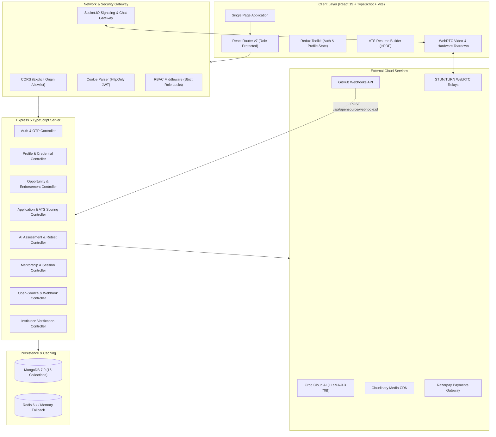

# PortalAcademia

> **Smart India Hackathon 2026 — Problem Statement 26044 (Ministry of Ayush)**  
> **Centralized Academia–Industry Collaboration, Verified Skill Credentials & Career Intelligence Platform**  
> Connecting Students, Faculty, Higher Education Institutions, and Industry Partners through cryptographically audited portfolios, objective ATS benchmarks, on-demand AI skill assessments, verified corporate talent pipelines, peer mentorship, and open-source contribution tracking.

<div align="center">

[](https://nodejs.org)
[](https://expressjs.com)
[](https://react.dev)
[](https://www.typescriptlang.org)
[](https://vitejs.dev)
[](https://tailwindcss.com)
[](https://www.mongodb.com)
[](https://redis.io)
[](https://groq.com)
[](server/package.json)

</div>

---

## 📑 Core Documentation Directory

For in-depth architectural specifications, API schemas, and developer standards, see the [`docs/`](docs/) directory:

| Document | Scope & Contents |
|:---|:---|
| 📖 **[`docs/ARCHITECTURE.md`](docs/ARCHITECTURE.md)** | Subsystem designs, 15 Mongoose schemas, RBAC lifecycle, WebRTC teardown, and deployment topology |
| 📡 **[`docs/API.md`](docs/API.md)** | Complete REST endpoint contracts, payload schemas, query parameters, and error shapes |
| 🤝 **[`docs/CONTRIBUTING.md`](docs/CONTRIBUTING.md)** | Branch conventions, PR checklist, automated test suites, and pre-commit checks |

*(For developers and autonomous agents seeking complete system contracts, consult [`docs/`](docs/).)*

---

## 1. Problem Statement & Solution Summary

### The Structural Problem
Higher technical education in India faces three systemic structural gaps:
1. **Curriculum-Market Deficit**: Academic syllabi lag behind fast-evolving engineering frontiers (Cloud-Native, Generative AI, Systems Security, Embedded Systems).
2. **Unverified Credential Inflation**: Self-declared resume skills and non-proctored online certificates result in high screening costs and false positives for corporate talent acquisition.
3. **Fragmented Institutional Pipeline**: Universities and placement cells lack direct, authenticated channels to curate and endorse vetted industry postings to specific cohorts, while educators lack formal immersion into corporate R&D and funded faculty sabbaticals.

### The Solution: PortalAcademia
PortalAcademia provides a telemetry-backed, four-sided ecosystem engineered for SIH 2026 Problem Statement 26044:
- **Tamper-Evident Institutional Verification**: University training & placement cells audit submitted certifications and experience records with timestamped cryptographic stamps.
- **Groq-Powered AI Skill Assessments**: Dynamic, on-demand technical testing evaluating candidates through 5 scenario-based questions, automatically conferring verified skill badges upon scoring $\ge 70\%$.
- **Proof-of-Separation ATS Engine**: Deterministic candidate matching combining verified skill competency ($60\%$) and profile completeness ($40\%$) with a verified $\ge 35\%$ scoring separation gap between assessed and self-reported credentials.
- **Institutional Endorsement Desk**: Colleges review active industry listings and endorse them directly to their cohorts, rendering dynamic `"Recommended by [College Name]"` badges in student feeds.
- **Peer Mentorship & WebRTC Video Advising**: Verified 4th-year senior scholars provide 1-on-1 audio/video advising with hardware track termination protocols and ATS profile boosts.
- **Open-Source GitHub Webhook Engine**: Industry partners register enterprise repositories; merged pull requests trigger SHA256 HMAC-verified webhooks to record contributions and issue verified achievement certificates.
- **Macro Market Diagnostics**: Real-time comparison across 5 macro engineering streams, isolating syllabus deficits against live industry hiring quotas.

---

## 2. Integrated Subsystems & Delivery Status

All platform capabilities are fully implemented, verified, and operational (**✅ Live**):

| Subsystem | Status | Implementation Reality & Architecture |
|:---|:---:|:---|
| **Four-Pillar Role Subsystems** | ✅ **Live** | Strict RBAC-locked workspaces for Student, Faculty, Institution, and Industry (`RoleProtectedRoute`). |
| **Unified ATS Scoring & Skill Match** | ✅ **Live** | Deterministic composite scoring ($0.60 \times \text{Skill} + 0.40 \times \text{Completeness}$) with 35% verified separation gap (`testAtsParity.ts`). |
| **Dynamic AI Skill Assessment Engine** | ✅ **Live** | Groq LLaMA-3.3 70B 5-question test runner with auto-submission timer and verified profile badge updates. |
| **Contextual AI Career & Academic Guide** | ✅ **Live** | Groq-powered multi-turn career advisor with dynamic profile injection and chat history. |
| **Institutional Campus Broadcasts & Scoped Directory** | ✅ **Live** | Targeted campus announcements (students/faculty) and alumni-scoped directory with IDOR protection (`testInstitutionScoping.ts`). |
| **Peer Mentorship & WebRTC 1-on-1 Advising** | ✅ **Live** | Direct WebRTC audio/video calling, Socket.IO signaling, STUN/TURN integration, and hardware media track teardown protocol. |
| **Open-Source PR Verification & Webhooks** | ✅ **Live** | Dual-channel contribution tracking: automated SHA256 HMAC webhooks and on-demand PR REST verification, validating destination repo and commit authorship against student profile. |
| **Enterprise Technical Community Spaces** | ✅ **Live** | Real-time Socket.IO channel messaging with role authorization (Institution/Faculty/Industry free, Student via pass). |
| **Razorpay Membership & Trial Tiers** | ✅ **Live** | Razorpay checkout integration, 7-day trial progression, and ₹200 / 30-day subscription pass management. |

---

## 3. Key Features by Role Pillar

### 🎓 Student Workspace
- ✅ **Opportunity Marketplace (`/dashboard/student`)**: Browse internships, jobs, hackathons, and research projects with category, mode (remote/hybrid/on-site), and keyword filtering.
- ✅ **Institutional Endorsement Highlights**: Postings endorsed by the student's own college display a prominent `"Recommended by [College Name]"` badge.
- ✅ **1-Click ATS Resume Builder**: In-browser resume composer with contact details, education, work experience, verified credentials, and client-side PDF export via `jsPDF`.
- ✅ **Skill Management with Brand Icons**: Search and select from 3,000+ developer technologies powered by `simple-icons` with verified hex brand colors.
- ✅ **On-Demand AI Skill Assessments (`/assessments`)**: Take timed 5-question evaluations generated via Groq LLaMA-3.3 to earn verified skill tags on profiles.
- ✅ **Market Trends & Skill Gap Diagnostics (`/trends/student`, `/trends/diagnosis`)**: Trajectory curves across 5 macro tech streams with candidate readiness percentages.
- ✅ **Application Pipeline Tracker (`/applications`)**: Live visibility into submitted proposals and recruiter review statuses (`Under Review`, `Shortlisted`, `Interview`, `Offered`, `Rejected`).
- ✅ **Senior Scholar Peer Mentorship (`/premium?tab=mentors`)**: Book 1-on-1 advisory sessions with verified 4th-year scholars featuring in-call notes, direct WebRTC audio/video calling, and complete hardware media teardown.
- ✅ **Open-Source Contribution Hub (`/premium?tab=opensource`)**: Connect verified GitHub developer identity, verify pull requests and commits merged into partner company repositories on demand, track merged contributions, and inspect tamper-evident achievement certificates.
- ✅ **Razorpay Premium Subscription**: 7-day trial activation and ₹200 / 30-day passes unlocking advanced open-source repositories and enterprise community channels.

### 🔬 Faculty Immersion Workspace
- ✅ **Academic Immersion Marketplace (`/dashboard/faculty`)**: Discover Faculty Development Programs (FDPs), DST-SERB research grants, IEEE conferences, and corporate sabbaticals.
- ✅ **Endorsed Faculty Programs**: View training residencies endorsed by university administrators.
- ✅ **Faculty R&D Trends (`/trends/faculty`)**: National research grant allocation telemetry, Scopus indexing patterns, and NEP 2020 curriculum benchmarks.
- ✅ **Enterprise Technical Discussion Spaces**: Cross-institutional collaboration channels with verified industry researchers and engineers.

### 🏛️ Institution Administration Workspace
- ✅ **Credential Verification Gate (`/dashboard/institution`)**: Audit desk for reviewing student-submitted certifications and internships with 1-click verification stamps.
- ✅ **Opportunity Endorsement Desk**: Curate active industry postings and endorse them directly to enrolled students or faculty with modal confirmation.
- ✅ **Campus Announcements Broadcast**: Publish official notices with audience targeting (`All`, `Students Only`, `Faculty Only`).
- ✅ **Student & Alumni Directory (`/institution/directory`)**: Searchable roster with admission year filtering and automated enrolled vs. alumni partitioning.
- ✅ **Member Profile Review & Skill Diagnostics (`/institution/member/:id`)**: Inspect student or faculty profiles with IDOR-protected institutional scoping and 2026 curriculum gap diagnosis.
- ✅ **Cohort Placement Telemetry (`/trends/institution`)**: Aggregated institutional placement trends and deficit analytics without individual student bias.
- ✅ **Campus Community Channels**: Moderated institutional channels for student cohorts and departmental discussions.

### 💼 Industry & Recruiter Console
- ✅ **Opportunity Publishing Desk (`/dashboard/industry`)**: Publish technical roles, internships, and grants with customizable stipends, deadlines, locations, required skills, and audience tags (`student`, `faculty`, `both`).
- ✅ **Applicant Review & ATS Triage**: Inspect candidate profiles, view deterministic ATS match scores, examine resumes, and add reviewer notes.
- ✅ **Candidate Pipeline Management**: Transition candidate states from `Under Review` through `Shortlisted`, `Technical Interview`, `Offered`, or `Rejected`.
- ✅ **Open-Source Repository Registration**: Register enterprise GitHub repositories and generate SHA256 HMAC webhook secrets.
- ✅ **Automated PR Credential Issuance**: Issue cryptographically verifiable achievement certificates upon confirmed merged pull requests.
- ✅ **Industry Discussion Channels**: Real-time recruitment and technical Q&A channels with verified candidates.

---

## 4. Condensed Technology Stack

### Client Architecture
| Technology | Version | Purpose in Codebase |
|:---|:---:|:---|
| **React** | `v19.2` | Core UI engine utilizing modern hooks, context providers, and component architecture. |
| **TypeScript** | `v5.x / ~6.0` | Strict client-side typing across components, models, Redux slices, and API clients. |
| **Vite** | `v8.2` | High-performance build tool, fast HMR, and optimized production chunking. |
| **Tailwind CSS** | `v3.4` | Utility-first styling conforming to Gov-Tech/Enterprise anti-slop guidelines (0–6px radiuses, zinc palette). |
| **Radix UI** | Primitives | Accessible UI primitives (`Dialog`, `Tabs`, `Accordion`, `Checkbox`, `Label`). |
| **Redux Toolkit** | `v2.12` | Global authentication hydration (`authSlice`), session tracking, and user profile state. |
| **React Router** | `v7.18` | Declarative client routing with centralized `RoleProtectedRoute` role dispatch. |
| **Recharts** | `v3.10` | Responsive charts for market trajectories, deficit bars, and cohort analytics. |
| **Simple Icons & Lucide** | `v16.3` / `v1.41` | Authentic brand logos with official hex colors (`skillIcons.ts`) and minimalist action icons. |
| **jsPDF** | `v4.2` | Client-side ATS resume PDF generation and instant download. |
| **Socket.IO Client** | `v4.8` | Real-time signaling client for WebRTC negotiation and community space chat. |
| **WebRTC Native APIs** | Native | Peer-to-peer audio/video streaming, screen sharing, and ICE candidate negotiation. |

### Server Architecture
| Technology | Version | Purpose in Codebase |
|:---|:---:|:---|
| **Express.js** | `v5.2` | REST API framework handling modular routing, middleware pipelines, and error handling. |
| **Node.js** | `≥v20` | Native ESM runtime executing TypeScript directly via `tsx watch`. |
| **MongoDB & Mongoose** | `v7.0+` / `v9.9` | Primary document database with 15 strict schemas, compound indexes, and validations. |
| **Redis (`ioredis`)** | `v6.0` | In-memory distributed caching with graceful fallback for offline resilience. |
| **Passport.js & JWT** | `v0.7` / `v9.0` | Google OAuth 2.0 social login and dual HttpOnly cookie session management (`accesstoken`, `refreshtoken`). |
| **Socket.IO Server** | `v4.8` | WebSocket server managing WebRTC signaling rooms and authorized community chat. |
| **Groq Cloud SDK** | LLaMA-3.3 70B | Ultra-low-latency AI engine generating dynamic quizzes and contextual career guidance. |
| **Multer & Cloudinary** | `v2.3` / `v2.11` | Secure multipart profile picture, resume, and institutional credential asset storage. |
| **Nodemailer** | `v10.0` | Transactional email delivery for 6-digit registration OTPs and opportunity alerts. |
| **pdf-parse & mammoth** | `v2.4` / `v1.12` | Text extraction from candidate PDF/DOCX resumes for automated ATS scoring. |
| **Razorpay SDK** | `v2.9` | Subscription tier order creation and webhook signature validation. |

---

## 5. High-Level Architecture



> For the comprehensive component catalog, model schemas, and state life cycles, see [`docs/ARCHITECTURE.md`](docs/ARCHITECTURE.md).

---

## 6. Getting Started & Local Development

### Prerequisites
- **Node.js**: `v20.0.0` or higher
- **npm**: `v10.0.0` or higher
- **MongoDB**: Local MongoDB instance (`v7.0+`) or MongoDB Atlas URI
- *(Optional)* **Docker & Docker Compose**: For containerized local MongoDB and Redis
- *(Optional)* **Redis**: Local server running on `127.0.0.1:6379` (server falls back gracefully to in-memory mode if absent)
- **Groq API Key**: Free tier available from [console.groq.com](https://console.groq.com)

---

### Step 1: Clone the Repository
```bash
git clone https://github.com/PrakharAgarwal17/PortalAcademia.git
cd PortalAcademia
```

---

### Step 2: Configure Environment Variables

#### Backend Configuration (`server/.env`)
Create `server/.env` with the following variables:
```env
# Server Port & Core URLs
PORT=3000
FRONTEND_URL=http://localhost:5173

# Database Connections
MONGO_URL=mongodb://127.0.0.1:27017/PortalAcademia
REDIS_URL=redis://127.0.0.1:6379

# Session & JWT Secrets
JWT_PASS_KEY=your_secure_random_jwt_secret_sih2026
SESSION_SECRET=your_secure_session_secret_sih2026

# AI Engine (Groq LLaMA-3.3 70B)
GROQ_API_KEY=gsk_your_groq_api_key_here

# Cloudinary Storage
CLOUDINARY_CLOUD_NAME=your_cloudinary_cloud_name
CLOUDINARY_API_KEY=your_cloudinary_api_key
CLOUDINARY_API_SECRET=your_cloudinary_api_secret

# Transactional Email (Gmail App Password)
EMAIL=your_email@gmail.com
PASSWORD=your_16_character_gmail_app_password

# Payments (Test Mode)
RAZORPAY_KEY_ID=rzp_test_your_key_id
RAZORPAY_KEY_SECRET=your_razorpay_secret
```

#### Frontend Configuration (`client/.env`)
Create `client/.env` pointing to the backend:
```env
VITE_API_BASE_URL=http://localhost:3000
```

---

### Step 3: Local Infrastructure via Docker (Optional)

You can launch MongoDB and Redis locally using the included `docker-compose.yml`:
```bash
docker compose up -d
```

> [!WARNING]
> **Security Notice regarding `docker-compose.yml`**:  
> The default credentials specified in `docker-compose.yml` (`MONGO_INITDB_ROOT_USERNAME: root`, `MONGO_INITDB_ROOT_PASSWORD: rootpassword`) are **strictly intended for isolated local development**. Never deploy these containers to staging or production environments with default credentials.

---

### Step 4: Install Dependencies & Run Development Servers

Open two terminal sessions:

#### Terminal 1 — Backend Server
```bash
cd server
npm install
npm run dev
# Server listening on http://localhost:3000
```

#### Terminal 2 — Frontend Client
```bash
cd client
npm install
npm run dev
# Vite application active on http://localhost:5173
```

---

### Step 5: Database Seeding & Verification

Populate the database with test accounts, realistic opportunities, community channels, and sample assessments:

```bash
cd server

# 1. Seed core roles, opportunities, mentorship profiles, community spaces, and assessments
npx tsx scripts/seedDatabase.ts

# 2. (Optional) Seed 10 realistic candidate resumes for ATS scoring tests
npx tsx scripts/seed10TopResumes.ts
```

#### Seeded Test Credentials
| Stakeholder Role | Email | Password | Console Route |
|:---|:---|:---|:---|
| **Student** | `student.test@portalacademia.ac.in` | `Password123!` | `/dashboard/student` |
| **Faculty Member** | `faculty.test@portalacademia.ac.in` | `Password123!` | `/dashboard/faculty` |
| **Institution Placement Cell** | `iitb.admin@portalacademia.ac.in` | `Password123!` | `/dashboard/institution` |
| **Industry Recruiter** | `industry.test@company.com` | `Password123!` | `/dashboard/industry` |

---

### Step 6: Automated Test Verification

Verify core scoring and scoping logic by running the automated benchmark suites:

```bash
cd server

# Verify ATS scoring proof-of-separation (>=35% gap between verified & self-reported)
npx tsx scripts/testAtsParity.ts

# Verify institution scoping, IDOR defense, and alumni gating
npx tsx scripts/testInstitutionScoping.ts
```

---

## 7. Trimmed Project Structure

```
PortalAcademia/
├── client/                          # React 19 + TypeScript + Vite SPA
│   ├── src/
│   │   ├── components/              # Reusable UI widgets (Navbar, SkillBadge, Modals, VideoCall)
│   │   ├── context/                 # Redux Toolkit store (authSlice), theme context
│   │   ├── lib/                     # skillIcons.ts (Simple-Icons), utils.ts (cn)
│   │   ├── pages/
│   │   │   ├── dashboards/          # Student, Faculty, Institution, Industry dashboards
│   │   │   ├── institution/         # Directory & Member diagnostic inspection
│   │   │   ├── trends/              # Macro market trajectories & skill gap diagnosis
│   │   │   ├── onboarding/          # Stakeholder onboarding wizard
│   │   │   └── PremiumDashboard.tsx # Mentorship, Open Source, and Community suite
│   │   ├── App.tsx                  # Client routing and RoleProtectedRoute definitions
│   │   └── main.tsx                 # Application entry point
│   ├── package.json
│   └── vite.config.ts
│
├── server/                          # Express 5 + TypeScript Backend API
│   ├── config/                      # connectDB.ts, redisClient.ts, Passport.ts
│   ├── controllers/                 # REST controllers (auth, opportunity, assessment, etc.)
│   ├── middleware/                  # isloggedIn.ts (JWT refresh), rbacMiddleware.ts
│   ├── models/                      # 15 Mongoose schemas (User, Profile, Opportunity, etc.)
│   ├── routes/                      # Express route definitions
│   ├── scripts/                     # Seed scripts and automated verification benchmarks
│   ├── sockets/                     # Socket.IO handlers (mentorship signaling, community chat)
│   ├── app.ts                       # Express server initialization and middleware stack
│   └── package.json
│
├── docs/                            # Consolidated System Documentation
│   ├── ARCHITECTURE.md              # System design, data flows, schemas, and security
│   ├── API.md                       # Comprehensive REST endpoint specifications
│   └── CONTRIBUTING.md              # Branch conventions, test commands, and PR guidelines
│
├── docker-compose.yml               # Local development MongoDB & Redis services
└── README.md                        # Project overview, tech stack, and setup instructions
```

> For exhaustive file trees and route tables, consult [`docs/ARCHITECTURE.md`](docs/ARCHITECTURE.md) and [`docs/API.md`](docs/API.md).

---

## 8. Security & Privacy Posture

PortalAcademia enforces a defense-in-depth architecture adhering to Indian statutory norms (including the **Digital Personal Data Protection Act 2023**):

- **Stateless HttpOnly Session Cookies**: Authentication tokens (`accesstoken` with 15-minute expiry and `refreshtoken` with 7-to-30 day expiry) are set with `HttpOnly`, preventing JavaScript access and neutralizing XSS token theft.
- **Decoupled Developer Verification**: GitHub OAuth 2.0 is decoupled from platform login/signup and restricted strictly to linking developer identity for PR verification, preventing unauthorized account creation vectors.
- **API Rate Limiting & DoS Defense**: Redis-backed sliding-window rate limiters gate costly LLM operations, auth attempts, and public endpoints.
- **Strict Input Sanitization & Allow-Lists**: NoSQL injection protection and explicit field allow-lists prevent parameter pollution and mass-assignment vulnerabilities.
- **Automatic Token Rotation**: Middleware (`isloggedIn.ts`) transparently issues fresh short-lived access tokens from valid refresh tokens without interrupting user workflows.
- **Cryptographic Password Hashing**: Passwords are saved with `bcrypt` (10 salt rounds) and excluded from responses.
- **Strict Role-Based Access Control (RBAC)**: All sensitive routes execute `rbacMiddleware.ts` to block cross-role privilege escalation.
- **Resource-Level Authorization (IDOR Defense)**: Handlers for institutional directories, applications, and student diagnostics verify the requester's ownership before returning data.
- **Hardware Privacy Teardown**: The WebRTC peer mentorship suite strictly terminates all active audio and video tracks on modal close to guarantee camera and microphone hardware indicators power off completely.

> Read our full [Privacy Policy](client/src/pages/PrivacyPage.tsx) and [Terms of Service](client/src/pages/TermsPage.tsx) for complete statutory disclosure.

---

## 9. Hackathon Context, Team & License

- **Competition**: **Smart India Hackathon (SIH) 2026**
- **Problem Statement**: **26044 — Centralized Academia-Industry Collaboration Platform**
- **Ministry / Organization**: **Ministry of Ayush**
- **License**: Released under the **ISC License** (see [`server/package.json`](server/package.json)) with open-source reference implementations for educational evaluation.
- **Contributions**: Please read [`docs/CONTRIBUTING.md`](docs/CONTRIBUTING.md) before submitting pull requests.
