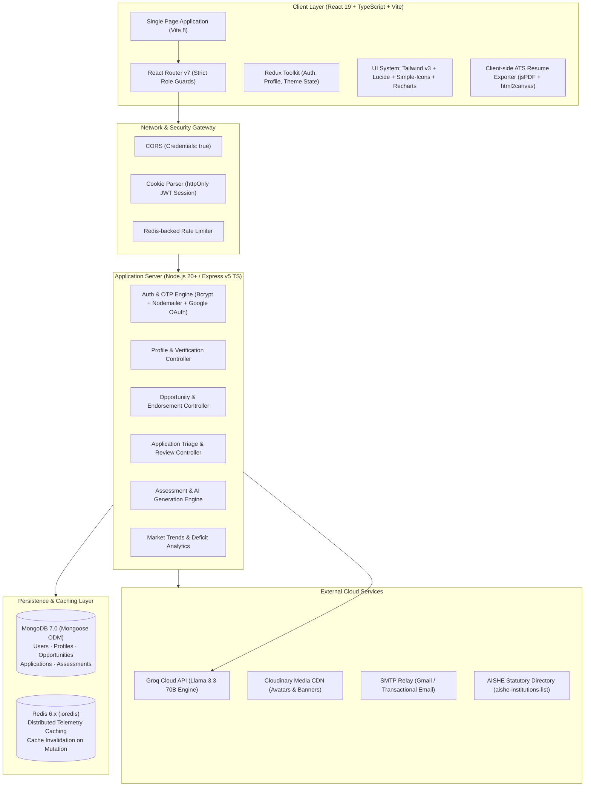
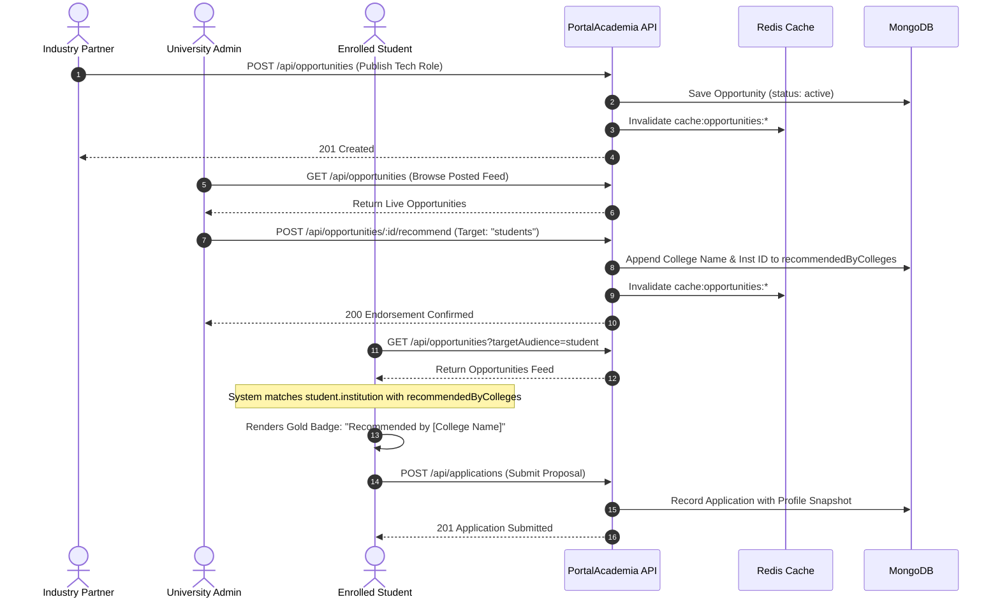

# PortalAcademia

<div align="center">

**Smart India Hackathon 2026 — Problem Statement 26044**  
### Enterprise Academia-Industry Collaboration, Verified Skill Credentials & Career Intelligence Platform

[](https://nodejs.org)
[](https://expressjs.com)
[](https://react.dev)
[](https://www.typescriptlang.org)
[](https://vitejs.dev)
[](https://tailwindcss.com)
[](https://www.mongodb.com)
[](https://redis.io)
[](https://groq.com)
[](LICENSE)

*Connecting Students, Faculty, Academic Institutions, and Industry Partners through cryptographically audited credentials, real-time market demand benchmarks, on-demand AI skill assessments, and streamlined corporate endorsement pipelines.*

</div>

## 📑 Core Documentation

PortalAcademia follows a consolidated, production-grade documentation structure:

| Document | Scope |
|:---|:---|
| 📖 **[`README.md`](README.md)** | High-level project overview, tech stack, local setup, and repository layout |
| 🏗️ **[`docs/ARCHITECTURE.md`](docs/ARCHITECTURE.md)** | System overview, client-server data flow, Mongoose schemas, auth flow, and deployment |
| 📡 **[`docs/API.md`](docs/API.md)** | Complete REST endpoint contracts, payloads, query parameters, and error shapes |
| 🤝 **[`docs/CONTRIBUTING.md`](docs/CONTRIBUTING.md)** | Branch naming conventions, PR guidelines, verification standards, and Git workflow |

---

## 📑 Table of Contents

1. [Executive Summary & Problem Statement](#1-executive-summary--problem-statement)
2. [High-Level Architecture](#2-high-level-architecture)
   - [System Architecture Diagram](#system-architecture-diagram)
   - [Data Flow & Endorsement Lifecycle](#data-flow--endorsement-lifecycle)
3. [Comprehensive Tech Stack](#3-comprehensive-tech-stack)
4. [Stakeholder Portals & Feature Matrix](#4-stakeholder-portals--feature-matrix)
   - [Student Portal](#a-student-portal)
   - [Faculty Immersion Portal](#b-faculty-immersion-portal)
   - [Institution Administration Portal](#c-institution-administration-portal)
   - [Industry & Recruiter Console](#d-industry--recruiter-console)
5. [AI Assessment & Career Intelligence Engine](#5-ai-assessment--career-intelligence-engine)
6. [Market Trends & Skill Gap Diagnostics](#6-market-trends--skill-gap-diagnostics)
7. [Security, RBAC & Role Protection](#7-security-rbac--role-protection)
8. [Database Schema & Data Models](#8-database-schema--data-models)
9. [Complete API Reference (See API.md)](#9-complete-api-reference)
10. [Repository Directory Structure](#10-repository-directory-structure)
11. [Setup, Installation & Local Development](#11-setup-installation--local-development)
    - [Prerequisites](#prerequisites)
    - [Environment Configuration](#environment-configuration)
    - [Database Seeding](#database-seeding)
    - [Running the Application](#running-the-application)
12. [License & Acknowledgements](#12-license--acknowledgements)

---

## 1. Executive Summary & Problem Statement

### The Problem
Traditional higher technical education faces critical structural bottlenecks:
- **Curriculum-Market Misalignment**: Academic syllabi lag 2–3 years behind rapid technological shifts (AI/ML, Cloud-Native, Systems Security, VLSI).
- **Unverified Credential Inflation**: Self-declared resume skills and non-proctored certificates result in high screening costs for corporate talent teams.
- **Fragmented Industry-Academia Linkages**: Lack of formal channels for university placement cells to endorse vetted industry opportunities to specific cohorts.
- **Faculty Stagnation**: Limited avenues for educators to undertake faculty development programs (FDPs), industry sabbaticals, and applied research grants.

### The Solution: PortalAcademia
PortalAcademia provides a unified, telemetry-backed operational ecosystem designed for national scale:
- **Cryptographically Audited Portfolios**: Institutional Placement & Training Offices verify student certifications and internships with timestamped audit trails.
- **Groq-Powered AI Skill Assessments**: Dynamic, on-demand technical testing that evaluates candidates and automatically awards verified skill badges upon passing.
- **One-Click Institutional Endorsements**: Colleges review industry postings and endorse them directly to their students or faculty, highlighting them as **"Recommended by [College Name]"**.
- **Macro & Micro Market Trends**: Real-time comparison across 5 macro engineering streams, isolating syllabus deficits against live hiring quotas.
- **1-Click ATS Resume Builder**: Instant PDF export powered by `jsPDF` and brand icons from `simple-icons`.

---

## 2. High-Level Architecture

### System Architecture Diagram



### Data Flow & Endorsement Lifecycle



---

## 3. Comprehensive Tech Stack

| Layer | Technology | Version | Purpose & Usage in Codebase |
|:---|:---|:---|:---|
| **Frontend Framework** | **React** | `v19.0.0` | Core UI library with modern hooks, Suspense, and functional components. |
| **Language** | **TypeScript** | `v5.x` | Strict end-to-end type safety across client models, server controllers, and database schemas. |
| **Build Tool** | **Vite** | `v8.2.2` | Ultra-fast HMR and optimized production bundling with Rolldown. |
| **Styling & CSS** | **Tailwind CSS** | `v3.4.17` | Utility-first responsive design, dark/light theme tokens, and custom animation utilities. |
| **State Management** | **Redux Toolkit** | `v2.5.1` | Global auth hydration (`authSlice`), session state, and profile state. |
| **Routing** | **React Router** | `v7.1.5` | Client-side routing with `<ProtectedRoute>` and `<RoleProtectedRoute>` role guards. |
| **Charts & Graphs** | **Recharts** | `v2.15.1` | Multi-stream trajectory area charts, curriculum deficit bar charts, and salary distribution curves. |
| **Icons & Brand SVGs** | **Lucide React** + **Simple Icons** | `v0.475` / `v14.9` | 100+ UI action icons plus 3,000+ official tech brand logos with verified hex colors (`skillIcons.ts`). |
| **PDF Generation** | **jsPDF** + **html2canvas** | `v4.2.1` / `v1.4.1` | 1-click ATS resume document generation and rasterized multi-page export. |
| **Backend Framework** | **Express.js** | `v5.2.1` | REST API framework handling routing, error boundaries, and JSON body parsing. |
| **Database** | **MongoDB** | `v7.0+` | Primary NoSQL document store with Mongoose ODM schemas and index optimizations. |
| **Caching Layer** | **Redis** (`ioredis`) | `v6.0.0` | In-memory distributed caching for public opportunity feeds and telemetry with automatic fallback. |
| **AI Engine** | **Groq Cloud SDK** | `Llama 3.3 70B` | Real-time question generation, career chat advisor, and gap analysis. |
| **Authentication** | **JWT** + **Passport.js** | `v9.0` / `v0.7` | Signed httpOnly cookie sessions and Google OAuth 2.0 social login. |
| **Email Delivery** | **Nodemailer** | `v10.0.0` | Transactional email delivery for 6-digit cryptographic registration OTPs. |
| **Media CDN** | **Cloudinary** + **Multer** | `v2.11` / `v2.3` | Multipart profile picture and university credential upload processing. |
| **Statutory Data** | **aishe-institutions-list** | `v1.0.7` | Official Government of India AISHE code lookup for university validation. |

---

## 4. Stakeholder Portals & Feature Matrix

### A. Student Portal
- **Opportunity Marketplace (`/dashboard/student`)**:
  - Live filter by category (`Internship`, `Job`, `Hackathon`, `Workshop`, `Research`), mode (`Remote`, `Hybrid`, `On-site`), and search keywords.
  - **Dynamic Skill Match Percentage**: Compares candidate's verified profile skills against opportunity prerequisites.
  - **Institutional Endorsement Highlight**: Opportunities endorsed by the student's university display an animated gold star badge: `"Recommended by [College Name]"`.
  - **Duplicate Application Prevention**: Automatic state tracking changes the button to `"Applied"` once a proposal is submitted.
- **ATS Resume Builder & 1-Click PDF Export**:
  - Integrated modal supporting contact details, education, past internships, projects, and verified skills.
  - Real-time ATS compatibility scoring and 1-click download via `jsPDF`.
- **Skill Management with Brand Icons**:
  - Autocomplete search over 3,000+ technologies powered by `simple-icons`.
  - Official brand logos and authentic brand colors displayed on every badge.
- **Standardized Assessments (`/assessments`)**:
  - Take timed assessments to earn permanent cryptographic skill verification marks.
- **Market Trends & Skill Gap Diagnostics (`/trends/student`, `/trends/diagnosis`)**:
  - Macro trajectory graphs across 5 major software engineering streams.
  - Personalized diagnosis pinpointing high-demand 2026 enterprise skills missing from the student's profile.

### B. Faculty Immersion Portal
- **Academic Immersion & Grants Desk (`/dashboard/faculty`)**:
  - Discovery feed for Faculty Development Programs (FDPs), DST-SERB research grants, IEEE conferences, and corporate sabbaticals.
  - CAS & MHRD promotion credit alignment telemetry.
- **Faculty Trends & R&D Intelligence (`/trends/faculty`)**:
  - National grant allocation benchmarks, Scopus/IEEE indexing velocities, and NEP 2020 curriculum directives.
- **Institutional Alignment**:
  - View university-endorsed faculty training residencies.

### C. Institution Administration Portal
- **Credential Verification Gate (`/dashboard/institution`)**:
  - Audit queue for submitted student certificates and experience records.
  - Placement cell officers verify credentials with 1 click, attaching official university approval stamps.
- **Posted Opportunities & Endorsement Desk**:
  - Browse all active industry listings for students and faculty.
  - Filter by target audience (`All`, `For Students`, `For Faculty`) and category.
  - **Confirmation Modal**: Explicit confirmation dialog to endorse postings, automatically updating student feeds.
- **Faculty & Student Directory (`/institution/directory`)**:
  - Complete university roster with role filters (`Students`, `Faculty`), admission/batch year filters, and live search.
- **Member Profile Review & Skill Diagnostics (`/institution/member/:id`)**:
  - Inspect any student or faculty member's profile.
  - View verified skills alongside **Lacking Skills (2026 Market Gaps)** calculated against corporate demand benchmarks.
- **Institutional Macro Market Trends (`/trends/institution`)**:
  - University placement trajectory, cohort curriculum deficit analytics, and sector hiring demand curves (without individual student bias).

### D. Industry & Recruiter Console
- **Opportunity Publisher (`/dashboard/industry`)**:
  - Publish internships, jobs, hackathons, and sabbaticals with custom skill requirements, stipends, locations, and target audience (`student`, `faculty`, `both`).
- **Applicant Triage & Pipeline Management**:
  - Review applicant submissions with candidate match scores and profile snapshots.
  - Transition candidate states: `Under Review` ➔ `Shortlisted` ➔ `Technical Interview` ➔ `Offered` ➔ `Rejected`.

---

## 5. AI Assessment & Career Intelligence Engine

```mermaid
flowchart LR
    User([Student / Faculty]) -->|Selects Skill| ClientReq[Client Trigger]
    ClientReq -->|POST /api/assessments/generate-for-user| Server[Express Backend]
    Server -->|Prompt with Schema Constraint| Groq[Groq Llama 3.3 70B]
    Groq -->|5 Structured Questions + Answers| Server
    Server -->|Saves Assessment Document| DB[(MongoDB)]
    Server -->>|Delivers Timed Quiz| Modal[Assessment Runner Modal]
    Modal -->|POST /submit| Server
    Server -->|Score >= 70%| Badging[Award Verified Skill Badge]
    Badging -->|Persisted to Profile| DB
```

1. **Dynamic Test Generation**:
   - When a user chooses to test any technology, Groq's high-speed Llama 3.3 model generates 5 objective multiple-choice questions complete with scenario-based premises, 4 options, balanced weights, and pedagogical explanations.
2. **Proctored Countdown Modal**:
   - Timed test runner with auto-submission upon timer expiry.
3. **Automated Skill Verification**:
   - Achieving $\ge 70\%$ automatically updates the user's profile, elevating the skill badge to **Verified** across all dashboard feeds and recruiter search tables.

---

## 6. Market Trends & Skill Gap Diagnostics

PortalAcademia categorizes the tech industry into 5 core macro streams:
1. **Generative AI & LLM Systems** (PyTorch, LangChain, Vector DBs, vLLM, Triton)
2. **Cloud-Native & Distributed Computing** (Kubernetes, Docker, Go, gRPC, Terraform)
3. **Full-Stack & Enterprise Web** (TypeScript, React, Next.js, Node.js, PostgreSQL)
4. **Cybersecurity & Zero-Trust Architecture** (eBPF, Rust, SIEM, Penetration Testing)
5. **Mobile & Edge Embedded Systems** (Flutter, Swift, Embedded C++, WebAssembly)

### Personalized Skill Diagnosis (`/trends/diagnosis`)
- Benchmarks candidate skills against high-priority market vectors.
- Calculates an individual **Readiness Percentage**.
- Suggests targeted remediation paths with direct links to take AI assessments.

---

## 7. Security, RBAC & Role Protection

PortalAcademia enforces a strict defense-in-depth security model:

```
Unauthenticated User
       │
       ▼
   /auth (Email OTP / Google OAuth)
       │
       ▼
  JWT Issued (httpOnly, Secure, SameSite: Lax)
       │
       ▼
   /onboarding (Select: Student | Faculty | Institution | Industry)
       │
       ▼
   RoleProtectedRoute (Strict Role Match)
   ├── student     ──> /dashboard/student, /trends/student, /trends/diagnosis
   ├── faculty     ──> /dashboard/faculty, /trends/faculty
   ├── institution ──> /dashboard/institution, /institution/directory, /institution/member/:id, /trends/institution
   └── industry    ──> /dashboard/industry
```

- **httpOnly Cookies**: JWT tokens cannot be read by browser JavaScript, preventing XSS token exfiltration.
- **Role Guards (`RoleProtectedRoute`)**: Prevents cross-role access (e.g., a student attempting to access `/dashboard/institution` or an institution viewing student diagnosis).
- **Mongoose ObjectId Validation**: Sanitizes and validates all route parameters to defend against injection attacks.

---

## 8. Database Schema & Data Models

PortalAcademia models are organized under `server/models/`:

| Model | File | Primary Responsibility | Key Fields |
|:---|:---|:---|:---|
| **User** | `userModel.ts` | Authentication and account status | `email`, `password` (hashed), `provider`, `isVerified`, `isOnboarded` |
| **Profile** | `profileModel.ts` | Complete stakeholder persona | `userId`, `accountType`, `name`, `headline`, `institution`, `aisheCode`, `skills[]`, `certifications[]`, `education[]`, `pastExperience[]` |
| **Opportunity** | `opportunityModel.ts` | Job, internship, grant, and hackathon postings | `title`, `organization`, `category`, `domain`, `stipendOrPrize`, `requiredSkills[]`, `targetAudience`, `recommendedByColleges[]`, `recommendedToStudentsBy[]`, `recommendedToFacultyBy[]`, `status` |
| **Application** | `applicationModel.ts` | Student/faculty candidate proposals | `opportunityId`, `applicantId`, `applicantType`, `status`, `coverLetter`, `resumeUrl`, `matchScore` |
| **Assessment** | `assessmentModel.ts` | Dynamic and standardized skill evaluations | `title`, `skillVectors[]`, `questions[]` (`questionText`, `options[]`, `correctOptionIndex`, `explanation`), `passPercentage` |
| **AssessmentResult** | `assessmentResultModel.ts` | User test submission records | `userId`, `assessmentId`, `score`, `passed`, `verifiedSkillsGranted[]` |

---

## 9. Complete API Reference

### Authentication (`/api/auth`)
- `POST /api/auth/signup` — Dispatch 6-digit registration OTP to user's email.
- `POST /api/auth/verifyotp` — Verify OTP, provision user account, set httpOnly session cookie.
- `POST /api/auth/signin` — Authenticate via email/password.
- `POST /api/auth/SignOut` — Clear session cookie and invalidate token.
- `POST /api/auth/checkAuth` — Verify session cookie and hydrate Redux client state.
- `GET /api/auth/google` & `/api/auth/google/callback` — Google OAuth 2.0 flow.

### Profiles (`/api/profile`)
- `GET /api/profile/me` — Fetch currently authenticated user's profile.
- `GET /api/profile/:id` — Fetch public profile by profile or user ID.
- `PUT /api/profile` — Update bio, headline, skills, education, experience, and institutional metadata.
- `POST /api/profile/avatar` — Upload profile photo to Cloudinary.

### Opportunities (`/api/opportunities`)
- `GET /api/opportunities` — Fetch live opportunity marketplace with filters (`category`, `mode`, `targetAudience`, `search`).
- `GET /api/opportunities/:id` — Retrieve opportunity details.
- `POST /api/opportunities` — Publish technical listing (Industry/Institution).
- `PUT /api/opportunities/:id` — Edit active opportunity listing.
- `DELETE /api/opportunities/:id` — Close or delete listing.
- `POST /api/opportunities/:id/recommend` — Endorse opportunity for institutional cohorts (Target: `students` | `faculty`).

### Institutional Verification & Directory (`/api/verification`)
- `GET /api/verification/pending` — Fetch unverified student credentials queue for the institution.
- `PUT /api/verification/verify/:studentId/:credentialId` — Verify student credential and grant tamper-evident badge.
- `GET /api/verification/institution-students` — Query enrolled students filtered by year and search keywords.
- `GET /api/verification/institution-members` — Query all university members (students & faculty) with role checkboxes and batch filters.
- `GET /api/verification/institution-members/:id` — Retrieve member diagnostics (Verified Skills vs 2026 Lacking Market Skills).

### Applications (`/api/applications`)
- `POST /api/applications` — Submit application proposal for an opportunity.
- `GET /api/applications/my-applications` — Retrieve applicant's submitted proposals.
- `GET /api/applications/opportunity/:id` — Recruiter view of candidates who applied.
- `PUT /api/applications/:id/status` — Advance candidate status in review pipeline.

### Assessments & AI Engine (`/api/assessments`, `/api/ai`)
- `GET /api/assessments` — List standardized assessments.
- `POST /api/assessments/generate-for-user` — Generate on-demand 5-question technical quiz using Groq Llama 3.3 70B.
- `POST /api/assessments/:id/submit` — Submit quiz answers, calculate score, grant badges.
- `POST /api/ai/chat` — Contextual AI Career & Academic Advisor query handler.

---

## 10. Repository Directory Structure

```
PortalAcademia/
├── .repo_docs/                       # Comprehensive architectural & API documentation
│   ├── API_CONTRACTS.md              # Detailed API route definitions and payloads
│   ├── ARCHITECTURE.md               # System design patterns, security, and data flow
│   ├── COMPONENTS.md                 # Frontend component design system catalog
│   ├── ROUTES_AND_PAGES.md           # Route definitions, guards, and navigation matrix
│   ├── STATE_AND_DATA.md             # Redux store slices, Mongoose models, and caching
│   └── UTILS_AND_SERVICES.md         # Pure utilities, icon mapping, and helper functions
│
├── client/                           # React 19 + TypeScript + Vite Frontend SPA
│   ├── public/                       # Favicons, static role graphics, illustrations
│   ├── src/
│   │   ├── components/               # Navbar, SkillBadge, Modals, ResumeBuilder
│   │   │   ├── Navbar.tsx            # Global stakeholder navbar with dark mode & AI bot
│   │   │   ├── ResumeBuilderModal.tsx# ATS Resume Editor with 1-click jsPDF export
│   │   │   ├── SkillBadge.tsx        # Brand SVG badge with verified state
│   │   │   ├── SkillTestRunnerModal  # Proctored timer assessment runner
│   │   │   └── ProfileEditModal.tsx  # Granular multi-section profile editor
│   │   ├── context/                  # Redux toolkit store, authSlice, themeContext
│   │   ├── lib/                      # skillIcons.ts (Simple-Icons), utils.ts (cn)
│   │   ├── pages/
│   │   │   ├── dashboards/           # Student, Faculty, Institution, Industry Dashboards
│   │   │   ├── institution/          # InstitutionDirectoryPage, InstitutionMemberProfilePage
│   │   │   ├── trends/               # StudentTrendsPage, FacultyTrendsPage, StudentDiagnosisPage, InstitutionTrendsPage
│   │   │   ├── onboarding/           # Onboarding flow (SelectType, Individual, Organization)
│   │   │   ├── AiGuidePage.tsx       # Dedicated AI HelpBot Assistant console
│   │   │   ├── AuthPage.tsx          # Login & Signup with email OTP flow
│   │   │   ├── LandingPage.tsx       # Public landing page with problem statement
│   │   │   └── ProfilePage.tsx       # Stakeholder profile view
│   │   ├── App.tsx                   # Route declarations & RoleProtectedRoute definitions
│   │   └── main.tsx                  # Application entry point & Store Provider
│   ├── package.json
│   ├── tailwind.config.js
│   └── vite.config.ts
│
├── server/                           # Express v5 + TypeScript Backend API
│   ├── config/                       # connectDB.ts (Mongoose), redisClient.ts (ioredis)
│   ├── controllers/                  # auth, profile, opportunity, application, verification, assessment, ai
│   ├── middleware/                   # isloggedIn.ts (JWT cookie verification)
│   ├── models/                       # userModel, profileModel, opportunityModel, applicationModel, assessmentModel
│   ├── routes/                       # authRoute, profileRoute, opportunityRoute, applicationRoute, verificationRoute, assessmentRoute, aiRoute
│   ├── scripts/
│   │   ├── seedDatabase.ts           # Standard test credentials & assessments seed script
│   │   └── seed10TopResumes.ts       # 10 realistic candidate profiles with ATS resumes
│   ├── app.ts                        # Server entry point, middleware registration, and port binding
│   ├── package.json
│   └── tsconfig.json
│
├── docs/                             # Consolidated documentation folder
│   ├── ARCHITECTURE.md               # System design, data flow, schemas, auth, and deployment
│   ├── API.md                        # Comprehensive REST API endpoint reference
│   └── CONTRIBUTING.md               # Git workflow, branch conventions, and PR guidelines
├── docker-compose.yml                # Containerized local MongoDB & Redis configuration
└── README.md                         # Project overview, tech stack, and setup instructions
```

---

## 11. Setup, Installation & Local Development

### Prerequisites
- **Node.js** `v20.0.0` or higher
- **npm** `v10.0.0` or higher
- **MongoDB** (Local instance via Docker or MongoDB Atlas URI)
- *(Optional)* **Redis** server running locally on `127.0.0.1:6379`
- **Groq Cloud API Key** (Free tier available at [console.groq.com](https://console.groq.com))

---

### Environment Configuration

#### 1. Backend Configuration (`server/.env`)
Create `server/.env` with the following variables:

```env
# MongoDB Connection
MONGO_URL=mongodb://127.0.0.1:27017

# Security & Sessions
JWT_PASS_KEY=your_secure_random_jwt_key_here_sih2026
SESSION_SECRET=your_secure_session_secret_here

# Frontend URL (CORS origin)
FRONTEND_URL=http://localhost:5173

# Email OTP Service (Nodemailer Gmail App Password)
EMAIL=your_email@gmail.com
PASSWORD=your_16_character_gmail_app_password

# Groq Cloud AI Engine (Llama 3.3 70B)
GROQ_API_KEY=gsk_your_groq_api_key_here
GROK_API_KEY=gsk_your_groq_api_key_here

# Cloudinary (Profile Pictures & Document Uploads)
CLOUDINARY_CLOUD_NAME=your_cloudinary_cloud_name
CLOUDINARY_API_KEY=your_cloudinary_api_key
CLOUDINARY_API_SECRET=your_cloudinary_api_secret

# Redis Cache (Gracefully falls back if offline)
REDIS_URL=redis://127.0.0.1:6379
```

#### 2. Frontend Configuration (`client/.env`)
Create `client/.env` pointing to the backend server:

```env
VITE_API_BASE_URL=http://localhost:3000
```

---

### Database Seeding

To quickly populate test data including stakeholder accounts, assessments, and opportunities:

```bash
# In the server directory
cd server
npx tsx scripts/seedDatabase.ts
```

#### Seeded Test Credentials:
| Stakeholder Role | Email | Password |
|:---|:---|:---|
| **Student** | `student.test@portalacademia.ac.in` | `Password123!` |
| **Faculty Member** | `faculty.test@portalacademia.ac.in` | `Password123!` |
| **Institution Placement Cell** | `iitb.admin@portalacademia.ac.in` | `Password123!` |
| **Industry Recruiter** | `industry.test@company.com` | `Password123!` |

*(Optional)* To seed 10 rich candidate resumes for testing recruiter triage:
```bash
npx tsx scripts/seed10TopResumes.ts
```

---

### Running the Application

#### Start the Backend Server:
```bash
cd server
npm install
npm run dev
# Server listening on http://localhost:3000
```

#### Start the Frontend Client:
```bash
cd client
npm install
npm run dev
# Vite client active on http://localhost:5173
```

Open your browser and navigate to `http://localhost:5173` to explore PortalAcademia!

---

## 12. License & Acknowledgements

- **License**: Released under the **MIT License**.
- **Hackathon**: Developed for the **Smart India Hackathon 2026** under **Problem Statement 26044**.
- **Special Thanks**:
  - [Groq](https://groq.com) for ultra-low latency AI inference with Llama 3.3 70B.
  - [Simple Icons](https://simple-icons.org) for high-fidelity developer brand assets.
  - [Ministry of Education / AICTE](https://www.aicte-india.org) for national curriculum reform guidance.
