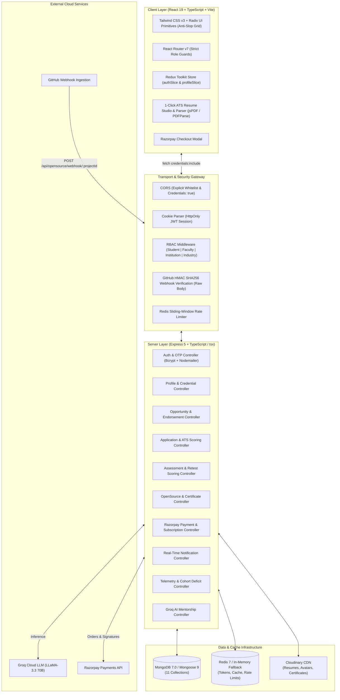
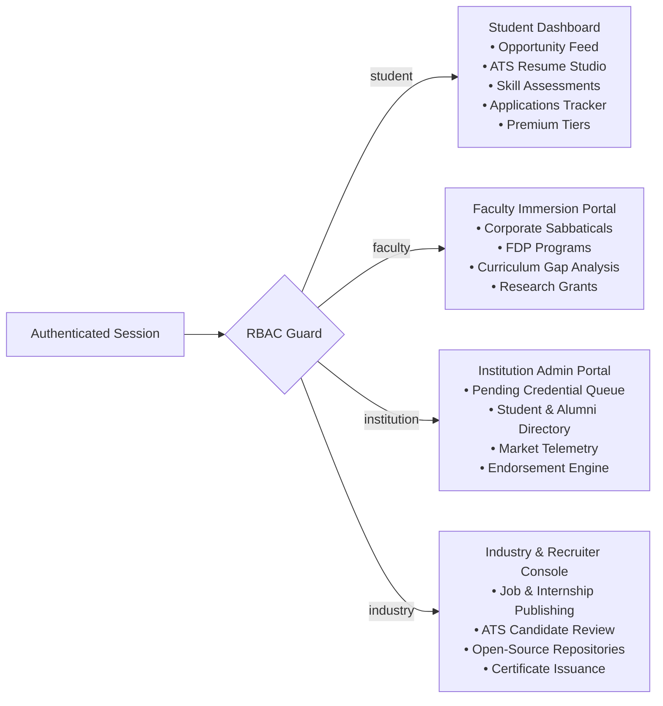

# Architecture & System Design — PortalAcademia

> **Smart India Hackathon 2026 — Problem Statement 26044**  
> Centralized, high-density Academia–Industry Collaboration Platform connecting Students, Faculty, Higher Education Institutions, and Industry Partners into a unified four-sided competency and opportunity exchange.

---

## 1. System Overview & Architecture

PortalAcademia addresses the structural gap between university curricula and enterprise workforce demands. It eliminates unverified resumes, unmeasured skill claims, and isolated academic research through integrated subsystems:

1. **Four-Pillar Role Subsystems**: Dedicated workspaces with role-locked navigation and tailored capabilities for **Student**, **Faculty**, **Institution**, and **Industry**.
2. **Deterministic Credential Verification Gate**: Institutions cryptographically verify student certifications, research, and projects before they appear on enterprise talent pipelines.
3. **Unified Objective Skill Match & ATS Scoring Engine**: 5-category deterministic scoring (Skills, Verified Badges, Experience, Education, Formatting) with proof-of-separation parity between candidates.
4. **Objective Skill Assessment Engine**: Standardized technical benchmark assessments yielding tamper-evident competency badges and verified skill tags with cumulative average-of-attempts retesting.
5. **Contextual AI Career Guide**: LLaMA-3 / Groq-powered conversational mentor with dynamic profile context injection and storage-preserving TTL safeguards.
6. **Open-Source Contribution Engine & Automated GitHub Webhooks**: Industry partners register enterprise open-source repositories; students contribute code; merged pull requests trigger SHA256 HMAC-verified webhooks to automatically record contributions, notify students, and allow companies to issue verifiable achievement certificates.
7. **Razorpay Membership & Payment Infrastructure**: Student tier progression supporting 7-day one-time free trials and ₹200 / 30-day subscriptions via Razorpay checkout, unlocking premium open-source repositories, recruiter talent pipelines, and specialized career tracks.



---

## 2. Technology Stack Specifications

| Layer | Technology | Version | Purpose & Rationale |
|:---|:---|:---|:---|
| **Client Core** | React | `^19.2.8` | Declarative component UI engine with React Compiler optimization |
| **Language (Client)** | TypeScript | `~6.0.2` | Strict client-side typing across components, models, and Redux store |
| **Build Tool** | Vite | `^8.2.2` | Ultra-fast HMR and Rollup production bundling |
| **Routing** | React Router DOM | `^7.18.3` | SPA client routing with centralized `DashboardRouter` role dispatch |
| **State Management** | Redux Toolkit | `^2.12.0` | Global session, auth status, user role, and profile state |
| **Styling** | Tailwind CSS + Radix UI | `^3.4.19` | Anti-slop enterprise UI, Swiss typographic density, 0-6px radiuses |
| **Server Core** | Express | `^5.2.1` | Asynchronous REST routing, middleware pipeline, ESM Node.js 20+ |
| **Language (Server)** | TypeScript | `^7.0.2` | Strict server typing run directly with `tsx watch app.ts` |
| **Database** | MongoDB / Mongoose | `^9.9.5` | Document store, strict schemas, aggregation pipelines, indexes |
| **Caching & Queue** | Redis (ioredis) | `^6.0.0` | Session rate-limiting, opportunities caching with graceful fallback |
| **Authentication** | Passport.js + JWT | `^0.7.0` / `^9.0.3` | Google OAuth 2.0 and HttpOnly JWT cookies (`accesstoken`, `refreshtoken`) |
| **Media & CDN** | Multer + Cloudinary | `^2.3.0` / `^2.11.0` | Cloud media persistence with memory storage buffer piping |
| **Document Parsing** | pdf-parse + mammoth | `^2.4.5` / `^1.11.0` | Text extraction from uploaded PDF & DOCX resumes for ATS scoring |
| **Payments** | Razorpay SDK | `^2.9.8` | Subscription management, trial tracking, HMAC signature verification |
| **AI Inference** | Groq Cloud SDK | API | Fast LLaMA-3.3 70B inference for AI Career & Academic Guide |

---

## 3. Client-Server Data Flow & Stakeholder Subsystems

PortalAcademia implements four isolated stakeholder portals backed by a single centralized user directory:



### Authentication Lifecycle & Session Flow
1. **Sign-In / Sign-Up**: Handled via `authController.ts`. Local accounts use bcrypt hashing (10 salt rounds). Email verification OTP is dispatched using Nodemailer to validate institutional or work email domains.
2. **Google OAuth 2.0**: Handled via Passport GoogleStrategy. Upon success, newly created users route to `/onboarding/select-type` while onboarded users route to `/dashboard`.
3. **Token Management**: The server issues two HttpOnly cookies:
   - `accesstoken`: 15-minute validity for stateless API authentication.
   - `refreshtoken`: 7-day (or 30-day "Remember Me") validity for seamless rotation.
4. **Token Refresh via Middleware**: `isloggedIn.ts` inspects `accesstoken`. If expired, it validates `refreshtoken`, issues a fresh `accesstoken`, and allows the request without dropping the session.
5. **Role-Based Authorization**: `rbacMiddleware.ts` queries the user's `Profile` collection to verify `accountType` (`student`, `faculty`, `institution`, `industry`) and rejects unauthorized cross-role attempts with HTTP 403.

### Gov-Tech & Enterprise Anti-Slop UI Architecture
PortalAcademia replaces generic consumer SaaS aesthetics with a high-density, Gov-Tech & Enterprise design framework:
1. **Geometric Discipline**:
   - Strict 0–6px border radiuses (`rounded-sm` for tags and inputs, `rounded-md` for cards and modals).
   - High-contrast monochromatic zinc palette (`bg-zinc-950`, `border-zinc-800`, `text-zinc-100`).
   - Absolute prohibition of floating purple/cyan glowing gradient cards and `backdrop-blur-*` washes.
2. **Deterministic UI State**:
   - Direct integration between Redux Toolkit (`authSlice`, `profileSlice`) and live backend API endpoints.
   - Zero mock data in production pathways: open-source projects, contributions, certificates, notifications, and telemetry originate from real Mongoose collections.
3. **Interactive Stakeholder Surfaces**:
   - **Student Dashboard**: Real-time application trackers, competency radar benchmarks, and verified "Premium Scholar" status badge strip.
   - **Premium Workspace (`/dashboard/premium`)**: Real-time Razorpay modal checkout, 7-day trial activation, live open-source project exploration, PR submission history, and cryptographic certificate inspection modals.
   - **Industry Console (`/dashboard/industry`)**: Enterprise project registration drawer, SHA256 webhook secret copy utility, and live merged-PR contributor credential issuance modals.
   - **Real-Time Notification Center**: Unread count badges in the main navigation bar, one-click mark-as-read (`PATCH /api/notifications/:id/read`), direct PR deep-linking, and bulk read operations.

---

## 4. Database Schemas & Data Models (Mongoose 9)

PortalAcademia enforces strict schemas with indexes, defaults, and relationships:

### Core Schemas Summary
1. **`User` (`server/models/userModel.ts`)**
   - Fields: `email`, `password` (hashed), `provider` (`local` | `google`), `providerID`, `isVerified`, `isOnboarded`, `isEmailVerified`, `planTier` (`free` | `trial` | `paid`), `isPremium`, `hasUsedTrial`, `trialEndsAt`, `premiumExpiresAt`.
   - Purpose: Authentication identity, account credentials, and subscription status.
2. **`Profile` (`server/models/profileModel.ts`)**
   - Fields: `userId` (ref `User`), `accountType`, `name`, `headline`, `bio`, `institution`, `institutionName`, `institutionEmail`, `isEmailVerified`, `isPremium`, `premiumExpiresAt`, `skills`, `verifiedSkills`, `education`, `certifications` (with `isVerified`, `verifiedBy`, `verifiedAt`), `pastExperience`, `github`, `linkedin`, `isAlumni`, `graduationYear`, `currentCompany`, `currentRole`.
   - Purpose: Master profile entity supporting multi-stakeholder attributes.
3. **`Opportunity` (`server/models/opportunityModel.ts`)**
   - Fields: `title`, `description`, `organization`, `createdBy` (ref `User`), `category` (`internship`, `hackathon`, `workshop`, `fdp`, `research`, `sabbatical`), `domain`, `location`, `mode`, `duration`, `stipendOrPrize`, `requiredSkills`, `eligibility`, `deadline`, `status` (`active` | `closed`), `targetAudience` (`student` | `faculty` | `both`), `recommendedByColleges`, `applicantCount`.
   - Purpose: Job, internship, and research grant postings.
4. **`Application` (`server/models/applicationModel.ts`)**
   - Fields: `opportunityId` (ref `Opportunity`), `applicantId` (ref `User`), `applicantName`, `applicantEmail`, `applicantInstitution`, `applicantSkills`, `matchScore`, `atsScore`, `resumeUrl`, `resumeData`, `status` (`Applied`, `Under Review`, `Shortlisted`, `Technical Interview`, `Offered`, `Rejected`), `appliedAt`, `notes`.
   - Purpose: Candidate application lifecycle and scoring tracking.
5. **`Assessment` (`server/models/assessmentModel.ts`)**
   - Fields: `title`, `category`, `description`, `timeLimitMinutes`, `passPercentage`, `skillVectors`, `questions` (`questionId`, `questionText`, `options`, `correctOptionIndex`, `explanation`, `weight`), `badgeAwarded`.
   - Purpose: Standardized technical and soft-skill benchmarking exams.
6. **`AssessmentResult` (`server/models/assessmentResultModel.ts`)**
   - Fields: `studentId` (ref `User`), `assessmentId` (ref `Assessment`), `assessmentTitle`, `score`, `totalQuestions`, `percentage`, `passed`, `badgeAwarded`, `verifiedSkillsAdded`, `relatedSkills`, `completedAt`, `answers`.
   - Purpose: Historical audit trail supporting average-of-attempts calculation.
7. **`OpenSourceProject` (`server/models/openSourceProjectModel.ts`)**
   - Fields: `postedBy` (ref `User`), `companyName`, `title`, `description`, `repoUrl`, `repoFullName`, `techStack`, `difficulty` (`beginner` | `intermediate` | `advanced`), `webhookSecret` (`select: false`), `isActive`, `createdAt`.
   - Purpose: Enterprise open-source repositories registered by industry partners.
8. **`Contribution` (`server/models/contributionModel.ts`)**
   - Fields: `projectId` (ref `OpenSourceProject`), `companyId` (ref `User`), `studentId` (ref `User`), `studentName`, `githubUsername`, `prUrl`, `prTitle`, `prNumber`, `mergedAt`, `certificateIssued`, `certificateIssuedAt`.
   - Purpose: Merged GitHub pull request contributions linked to student profiles.
9. **`Membership` (`server/models/membershipModel.ts`)**
   - Fields: `userId` (ref `User`), `planType` (`trial` | `premium`), `amount`, `currency`, `status` (`pending` | `active` | `expired` | `failed`), `razorpayOrderId`, `razorpayPaymentId`, `razorpaySignature`, `startDate`, `expiresAt`.
   - Purpose: Payment orders and subscription lifecycles.
10. **`Notification` (`server/models/notificationModel.ts`)**
    - Fields: `userId` (ref `User`), `type` (`pr_merged` | `certificate_issued` | `general`), `title`, `message`, `metadata`, `isRead`.
    - Purpose: Real-time user notification telemetry.
11. **`AiLog` (`server/models/aiLogModel.ts`)**
    - Fields: `userId` (ref `User`), `userRole`, `query`, `response`, `tokensUsed`, `modelUsed`, `createdAt` (with 7-day native MongoDB TTL expiration).
    - Purpose: Conversational mentor telemetry and audit logging with automatic threshold pruning (`pruneIfThresholdExceeded`) to prevent database storage saturation.

---

## 5. ATS Scoring & Assessment Parity Engine

The ATS scoring engine (`server/services/atsScoringService.ts`) is a pure, deterministic function evaluated out of 100 points:

$$\text{ATS Score} = S_{\text{skills}} + S_{\text{verified}} + S_{\text{experience}} + S_{\text{education}} + S_{\text{format}}$$

| Category | Max Weight | Evaluation Logic |
|:---|:---|:---|
| **Skills Relevance** | 40 pts | Direct & synonym match between candidate skills and opportunity `requiredSkills` |
| **Verified Credentials** | 20 pts | College-verified certificates (`+8 pts`) and passed assessment scores (`+12 pts`) |
| **Experience & Projects** | 20 pts | Relevant work experiences and projects with quantified metrics |
| **Education Alignment** | 10 pts | Degree relevance, field of study, and institution verification |
| **Structure & Formatting** | 10 pts | Contact completeness, professional summary, and section layout |

### Assessment Retesting & Cumulative Average
When a student retakes an assessment, their cumulative competency score is calculated dynamically across all attempts:
$$\text{Average Score} = \frac{\sum_{i=1}^{N} \text{Percentage}_i}{N}$$
This prevents gaming the system via single-attempt flukes and provides recruiters with a reliable competency benchmark.

---

## 6. Open-Source Webhooks & Razorpay Architecture

### GitHub Webhook Ingestion Pipeline
1. Industry partners register repositories (`POST /api/opensource/projects`) with an auto-generated SHA256 webhook secret.
2. Students submit Pull Requests on GitHub to active repositories.
3. Upon PR merge, GitHub dispatches `pull_request` event payload to:
   `POST /api/opensource/webhook/:projectId`
4. The server validates `X-Hub-Signature-256` HMAC signature using `crypto.createHmac("sha256", project.webhookSecret)` over the preserved `req.rawBody` buffer, with timing-safe comparison (`crypto.timingSafeEqual` with buffer length validation).
5. Upon signature match and `action === "closed" && pull_request.merged === true`, the system verifies the student's active premium status, creates a `Contribution` record, and fires an in-app notification.
6. Industry partners can issue verifiable achievement certificates (`POST /api/opensource/certificate`), which automatically pushes the verified credential to `studentProfile.certifications`.

### Razorpay Subscription & Free Trial Architecture
1. **Order Creation**: Client calls `POST /api/payment/create-order` with `{ planType: "trial" | "premium" }`.
   - For `trial`: If `!user.hasUsedTrial`, activates a 7-day trial directly, setting `hasUsedTrial: true`, `planTier: "trial"`, and `premiumExpiresAt`.
   - For `premium`: Creates a Razorpay order (`amount: 20000` paise for ₹200 / 30 days) and records a pending `Membership`.
2. **Payment Verification**: Client completes Razorpay checkout modal and sends `razorpay_order_id`, `razorpay_payment_id`, and `razorpay_signature` to `POST /api/payment/verify`.
3. **HMAC Signature Audit**: Server computes `crypto.createHmac("sha256", secret)` over `order_id + "|" + payment_id` and verifies using `crypto.timingSafeEqual`.
4. **Subscription Activation**: Server activates the membership for 30 days from verification time (`expiresAt = addDays(30)`), retires any previous active memberships, and sets `user.isPremium = true` and `user.planTier = "paid"`.

---

## 7. Deployment & Infrastructure Guide

PortalAcademia is architected for zero-cost or scalable enterprise deployment:

### Local Development (Docker Compose)
Spins up local MongoDB 7 and Redis 7 services:
```bash
docker compose up -d
```

### Production Deployment Architecture

```
Internet / DNS
      │
      ▼
Cloudflare CDN / DNS (SSL Termination, DDoS Protection)
      │
      ├──► Client: Vercel / Netlify (Static Vite SPA)
      │      • Base URL: https://portalacademia.ac.in
      │      • Environment: VITE_API_BASE_URL=https://api.portalacademia.ac.in
      │
      └──► Server: Render / Railway / AWS EC2 (Node.js Express 5 ESM)
             • Base URL: https://api.portalacademia.ac.in
             • MongoDB: MongoDB Atlas Replica Set (M0 / Dedicated)
             • Redis: Upstash / Redis Cloud
             • Media: Cloudinary CDN
```

### Cloudflare Tunnel Setup (Local to Public Demo)
To expose local development instances securely over HTTPS without port forwarding:
```yaml
# In docker-compose.yml:
services:
  cloudflared:
    image: cloudflare/cloudflared:latest
    container_name: portalacademia-cloudflared
    restart: unless-stopped
    command: tunnel --no-autoupdate run --token ${TUNNEL_TOKEN}
    extra_hosts:
      - "host.docker.internal:host-gateway"
```
Ensure `client/vite.config.ts` has `server.host = '0.0.0.0'` and `server.allowedHosts = true` to allow tunnel requests.
