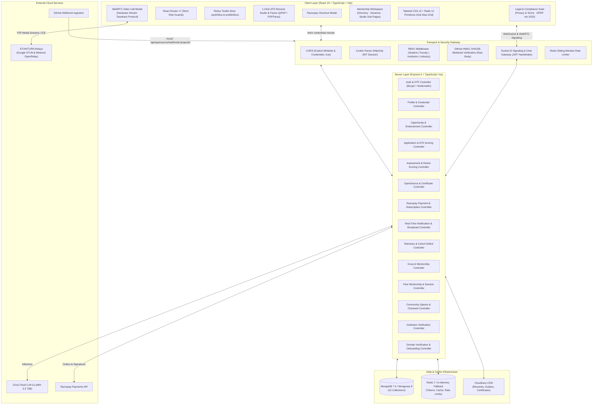
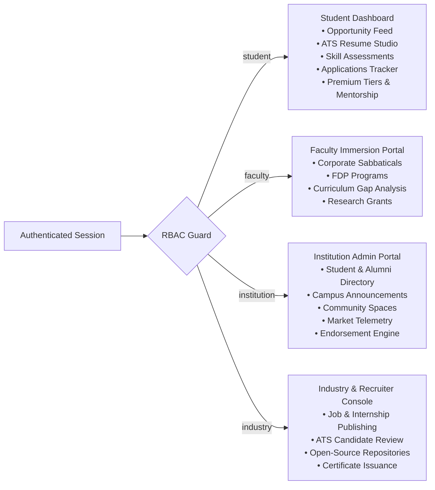
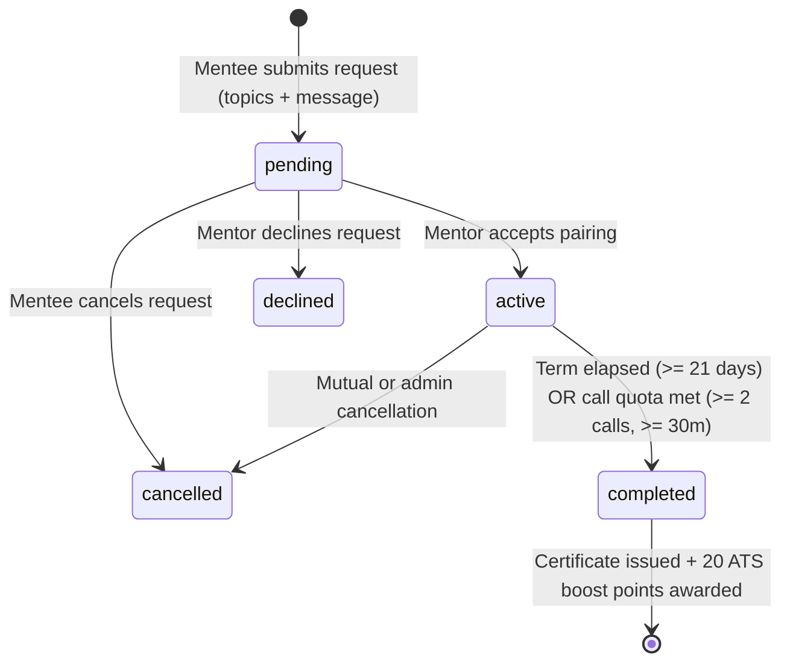
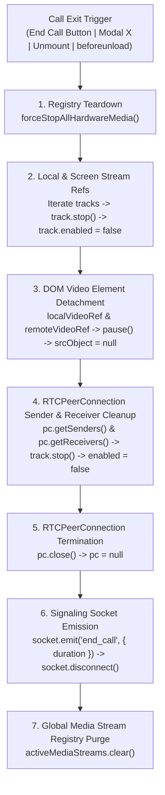

# Architecture & System Design — PortalAcademia

> **Smart India Hackathon 2026 — Problem Statement 26044**  
> Centralized, high-density Academia–Industry Collaboration Platform connecting Students, Faculty, Higher Education Institutions, and Industry Partners into a unified four-sided competency and opportunity exchange.

---

## 1. System Overview & Architecture

PortalAcademia addresses the structural gap between university curricula and enterprise workforce demands. It eliminates unverified resumes, unmeasured skill claims, and isolated academic research through integrated subsystems:

1. **Four-Pillar Role Subsystems**: Dedicated workspaces with role-locked navigation and tailored capabilities for **Student**, **Faculty**, **Institution**, and **Industry**.
2. **Student-Centric Credential Showcase & Unified Campus Broadcasts**: Students directly manage and showcase certifications on their profiles without bureaucratic verification bottlenecks. Institutions broadcast announcements to enrolled students and affiliated faculty.
3. **Unified Objective Skill Match & ATS Scoring Engine**: Deterministic composite scoring evaluated out of 100 points ($0.60 \times \text{SkillScore} + 0.40 \times \text{CompletenessScore}$) with assessment-backed skill weighting and proof-of-separation parity.
4. **Objective Skill Assessment Engine**: Standardized technical benchmark assessments yielding tamper-evident competency badges and verified skill tags with cumulative average-of-attempts retesting.
5. **Contextual AI Career Guide**: LLaMA-3.3 70B / Groq-powered conversational mentor with dynamic profile context injection and storage-preserving TTL safeguards.
6. **Open-Source Contribution Engine & Automated GitHub Webhooks**: Industry partners register enterprise open-source repositories; students contribute code; merged pull requests trigger SHA256 HMAC-verified webhooks to automatically record contributions, notify students, and allow companies to issue verifiable achievement certificates.
7. **Razorpay Membership & Payment Infrastructure**: Student tier progression supporting 7-day one-time free trials and ₹200 / 30-day subscriptions via Razorpay checkout, unlocking premium open-source repositories, recruiter talent pipelines, and specialized career tracks.
8. **Peer Mentorship, WebRTC 1-on-1 Video & Hardware Teardown Protocol**: Senior scholars (4th year) apply for free by pledging to the Mentor Honor Code. Junior scholars with active Premium schedule 1-on-1 advisory sessions featuring direct WebRTC audio/video calling with STUN and TURN relay fallback, in-call live chat notes, and misconduct reporting. Completion integrity gates enforce minimum term elapsed time or logged call volume before issuing Certificates of Appreciation and +20 ATS profile boosts. Complete hardware media stream teardown eliminates laptop camera/mic indicator light leaks.
9. **Enterprise Technical Spaces & Real-Time Chat**: Live industry community discussion channels powered by Socket.IO with socket-level authorization ensuring verified faculty, recruiters, and premium scholars can collaborate.
10. **Asynchronous Skill-Matched Opportunity Dispatches**: Non-blocking telemetry service using Nodemailer to alert relevant students when verified opportunities matching their verified skills are published.
11. **Legal, Governance & DPDP Act 2023 Compliance**: Rigorous compliance architecture incorporating India's Digital Personal Data Protection Act 2023, guaranteed 100% student IP ownership on open-source contributions, zero commercial data brokerage, and high-density Swiss typographic legal pages with live search and scrollspy TOC.



---

## 2. Technology Stack Specifications

| Layer | Technology | Version | Purpose & Rationale |
|:---|:---|:---|:---|
| **Client Core** | React | `^19.2.8` | Declarative component UI engine with React Compiler optimization |
| **Language (Client)** | TypeScript | `~6.0.2` | Strict client-side typing across components, models, and Redux store |
| **Build Tool** | Vite | `^8.2.2` | Ultra-fast HMR and Rollup production bundling |
| **Routing** | React Router DOM | `^7.18.3` | SPA client routing with centralized `DashboardRouter` role dispatch and sub-page tabs |
| **State Management** | Redux Toolkit | `^2.12.0` | Global session, auth status, user role, and profile state |
| **Styling & UI** | Tailwind CSS + Radix UI | `^3.4.19` | Anti-slop enterprise UI, Swiss typographic density, 0-6px radiuses, accessible primitives |
| **Icons & Visuals** | Lucide React | `^1.16.0` | Monochromatic lightweight iconography conforming to enterprise design standards |
| **Real-Time Client** | Socket.IO Client | `^4.8.1` | WebRTC signaling exchange, call chat, and enterprise space messaging |
| **Video & Media** | WebRTC Native APIs | Browser Native | Peer-to-peer audio/video streaming, screen sharing, ICE candidate exchange |
| **Server Core** | Express | `^5.2.1` | Asynchronous REST routing, middleware pipeline, ESM Node.js 20+ |
| **Language (Server)** | TypeScript | `^7.0.2` | Strict server typing run directly with `tsx watch app.ts` |
| **Database** | MongoDB / Mongoose | `^9.9.5` | Document store, 15 strict schemas, compound indexes, aggregation pipelines |
| **Caching & Queue** | Redis (ioredis) | `^6.0.0` | Session rate-limiting, opportunities caching with graceful in-memory fallback |
| **Authentication** | Passport.js + JWT | `^0.7.0` / `^9.0.3` | Google OAuth 2.0 and HttpOnly JWT cookies (`accesstoken`, `refreshtoken`) |
| **Real-Time Server** | Socket.IO Server | `^4.8.1` | Room-based signaling gateway with handshake cookie verification and RBAC |
| **Media & CDN** | Multer + Cloudinary | `^2.3.0` / `^2.11.0` | Cloud media persistence with memory storage buffer piping |
| **Document Parsing** | pdf-parse + mammoth | `^2.4.5` / `^1.11.0` | Text extraction from uploaded PDF & DOCX resumes for ATS scoring |
| **Payments** | Razorpay SDK | `^2.9.8` | Subscription management, trial tracking, HMAC signature verification |
| **AI Inference** | Groq Cloud SDK | API | Ultra-fast LLaMA-3.3 70B inference for AI Career & Academic Guide |

---

## 3. Client-Server Data Flow & Stakeholder Subsystems

PortalAcademia implements four isolated stakeholder portals backed by a single centralized user directory:



### Authentication Lifecycle & Session Flow
1. **Sign-In / Sign-Up**: Handled via `authController.ts`. Local accounts use bcrypt hashing (10 salt rounds). Email verification OTP is dispatched using Nodemailer to validate institutional or work email domains.
2. **Google OAuth 2.0**: Handled via Passport GoogleStrategy. Upon success, newly created users route to `/onboarding/select-type` while onboarded users route to `/dashboard`.
3. **Token Management**: The server issues two HttpOnly cookies:
   - `accesstoken`: 15-minute validity for stateless API authentication.
   - `refreshtoken`: 7-day (or 30-day "Remember Me") validity for seamless rotation.
4. **Token Refresh via Middleware**: `isloggedIn.ts` inspects `accesstoken`. If expired, it validates `refreshtoken`, issues a fresh `accesstoken`, and allows the request without dropping the session.
5. **Role-Based Authorization**: `rbacMiddleware.ts` queries the user's `Profile` collection to verify `accountType` (`student`, `faculty`, `institution`, `industry`) and rejects unauthorized cross-role attempts with HTTP 403.

### Gov-Tech & Enterprise Anti-Slop UI Architecture
PortalAcademia replaces generic consumer SaaS aesthetics with a high-density, Gov-Tech & Enterprise design framework:
1. **Geometric Discipline**:
   - Strict 0–6px border radiuses (`rounded-sm` for tags and inputs, `rounded-md` for cards and modals).
   - High-contrast monochromatic zinc palette (`bg-zinc-950`, `border-zinc-800`, `text-zinc-100`).
   - Absolute prohibition of floating purple/cyan glowing gradient cards and `backdrop-blur-*` washes.
2. **Deterministic UI State**:
   - Direct integration between Redux Toolkit (`authSlice`, `profileSlice`) and live backend API endpoints.
   - Zero mock data in production pathways: open-source projects, contributions, certificates, notifications, and telemetry originate from real Mongoose collections.
3. **Interactive Stakeholder Surfaces**:
   - **Student Dashboard**: Real-time application trackers, competency radar benchmarks, and verified "Premium Scholar" status badge strip.
   - **Premium Workspace (`/dashboard/premium`)**: 
     - **Open-Source Studio**: Real-time Razorpay checkout modal, 7-day trial activation, live open-source project exploration, PR submission history, and cryptographic certificate inspection modals.
     - **Peer Mentorship Suite**: Sub-page navigation (`?tab=mentors&sub=directory|sessions|studio`) encompassing mentor discovery, pairing management, and senior scholar control room.
   - **Industry Console (`/dashboard/industry`)**: Enterprise project registration drawer, SHA256 webhook secret copy utility, and live merged-PR contributor credential issuance modals.
   - **Real-Time Notification Center**: Unread count badges in the main navigation bar, one-click mark-as-read (`PATCH /api/notifications/:id/read`), direct PR deep-linking, and bulk read operations.

---

## 4. Database Schemas & Data Models (Mongoose 9)

PortalAcademia enforces strict schemas with indexes, defaults, and relationships across **15 distinct collections**:

### Core Schemas Summary

1. **`User` (`server/models/userModel.ts`)**
   - Fields: `email`, `password` (hashed, `select: false`), `provider` (`local` | `google`), `providerID`, `isVerified`, `isOnboarded`, `isEmailVerified`, `planTier` (`free` | `trial` | `paid`), `isPremium`, `hasUsedTrial`, `trialEndsAt`, `premiumExpiresAt`.
   - Purpose: Authentication identity, account credentials, and subscription status.

2. **`Profile` (`server/models/profileModel.ts`)**
   - Fields: `userId` (ref `User`), `accountType`, `name`, `headline`, `bio`, `institution`, `institutionName`, `institutionEmail`, `isEmailVerified`, `isPremium`, `premiumExpiresAt`, `skills`, `verifiedSkills`, `education`, `certifications` (with `isVerified`, `verifiedBy`, `verifiedAt`), `pastExperience`, `github`, `linkedin`, `isAlumni`, `graduationYear`, `currentCompany`, `currentRole`.
   - **Peer Mentorship Fields**: `isMentor`, `isMentorVerified`, `mentorBio`, `mentorTopics`, `mentorTermsAccepted`, `mentorTermsAcceptedAt`, `mentorTestScore`, `mentorTestPassedAt`, `atsBoostPoints`.
   - Purpose: Master profile entity supporting multi-stakeholder attributes and mentorship credentials.

3. **`Opportunity` (`server/models/opportunityModel.ts`)**
   - Fields: `title`, `description`, `organization`, `createdBy` (ref `User`), `category` (`internship`, `hackathon`, `workshop`, `fdp`, `research`, `sabbatical`), `domain`, `location`, `mode`, `duration`, `stipendOrPrize`, `requiredSkills`, `eligibility`, `deadline`, `status` (`active` | `closed`), `targetAudience` (`student` | `faculty` | `both`), `recommendedByColleges`, `applicantCount`.
   - Purpose: Job, internship, and research grant postings.

4. **`Application` (`server/models/applicationModel.ts`)**
   - Fields: `opportunityId` (ref `Opportunity`), `applicantId` (ref `User`), `applicantName`, `applicantEmail`, `applicantInstitution`, `applicantSkills`, `matchScore`, `atsScore`, `resumeUrl`, `resumeData`, `status` (`Applied`, `Under Review`, `Shortlisted`, `Technical Interview`, `Offered`, `Rejected`), `appliedAt`, `notes`.
   - Purpose: Candidate application lifecycle and scoring tracking.

5. **`Assessment` (`server/models/assessmentModel.ts`)**
   - Fields: `title`, `category`, `description`, `timeLimitMinutes`, `passPercentage`, `skillVectors`, `questions` (`questionId`, `questionText`, `options`, `correctOptionIndex`, `explanation`, `weight`), `badgeAwarded`.
   - Purpose: Standardized technical and soft-skill benchmarking exams.

6. **`AssessmentResult` (`server/models/assessmentResultModel.ts`)**
   - Fields: `studentId` (ref `User`), `assessmentId` (ref `Assessment`), `assessmentTitle`, `score`, `totalQuestions`, `percentage`, `passed`, `badgeAwarded`, `verifiedSkillsAdded`, `relatedSkills`, `completedAt`, `answers`.
   - Purpose: Historical audit trail supporting average-of-attempts calculation.

7. **`OpenSourceProject` (`server/models/openSourceProjectModel.ts`)**
   - Fields: `postedBy` (ref `User`), `companyName`, `title`, `description`, `repoUrl`, `repoFullName`, `techStack`, `difficulty` (`beginner` | `intermediate` | `advanced`), `webhookSecret` (`select: false`), `isActive`, `createdAt`.
   - Purpose: Enterprise open-source repositories registered by industry partners.

8. **`Contribution` (`server/models/contributionModel.ts`)**
   - Fields: `projectId` (ref `OpenSourceProject`), `companyId` (ref `User`), `studentId` (ref `User`), `studentName`, `githubUsername`, `prUrl`, `prTitle`, `prNumber`, `mergedAt`, `certificateIssued`, `certificateIssuedAt`.
   - Purpose: Merged GitHub pull request contributions linked to student profiles.

9. **`Membership` (`server/models/membershipModel.ts`)**
   - Fields: `userId` (ref `User`), `planType` (`trial` | `premium`), `amount`, `currency`, `status` (`pending` | `active` | `expired` | `failed`), `razorpayOrderId`, `razorpayPaymentId`, `razorpaySignature`, `startDate`, `expiresAt`.
   - Purpose: Payment orders and subscription lifecycles.

10. **`Mentorship` (`server/models/mentorshipModel.ts`)**
    - Fields: `mentorId` (ref `User`), `menteeId` (ref `User`), `status` (`pending` | `active` | `completed` | `cancelled` | `declined`), `startDate`, `targetEndDate`, `completedAt`, `notes`, `topics`, `callSessions` (`callRoomId`, `startedAt`, `endedAt`, `durationMinutes`), `totalCallDurationMinutes`, `menteeRating`, `menteeFeedback`, `ratedAt`, `certificateIssued`, `certificateIssuedAt`, `certificateId`.
    - Purpose: 1-on-1 peer mentorship pairings, WebRTC call logs, term completion records, and ratings.

11. **`MentorshipReport` (`server/models/mentorshipReportModel.ts`)**
    - Fields: `pairingId` (ref `Mentorship`), `reporterId` (ref `User`), `reportedUserId` (ref `User`), `reason`, `details`, `status` (`pending` | `investigating` | `action_taken` | `dismissed`), `actionNotes`, `actionTakenBy` (ref `User`), `actionTakenAt`.
    - Purpose: Session misconduct and safety incident reporting with administrative audit workflows.

12. **`CommunitySpace` (`server/models/communitySpaceModel.ts`)**
    - Fields: `name`, `description`, `industry`, `focus`, `avatarUrl`, `creatorId` (ref `User`), `members` (`User[]`), `memberCount`, `isPublic`, `allowedRoles` (`student`, `faculty`, `industry`, `institution`).
    - Purpose: Verified industry and research collaboration spaces.

13. **`CommunityMessage` (`server/models/communityMessageModel.ts`)**
    - Fields: `spaceId` (ref `CommunitySpace`), `senderId` (ref `User`), `senderName`, `senderAvatar`, `senderRole`, `content`, `attachments`.
    - Purpose: Chronological chat messages within enterprise community spaces.

14. **`Notification` (`server/models/notificationModel.ts`)**
    - Fields: `userId` (ref `User`), `type` (`pr_merged` | `certificate_issued` | `general` | `announcement`), `title`, `message`, `metadata`, `isRead`.
    - Purpose: Real-time user notification telemetry and campus announcements.

15. **`AiLog` (`server/models/aiLogModel.ts`)**
    - Fields: `userId` (ref `User`), `userRole`, `query`, `response`, `tokensUsed`, `modelUsed`, `createdAt` (with 7-day native MongoDB TTL expiration).
    - Purpose: Conversational mentor telemetry and audit logging with automatic threshold pruning (`pruneIfThresholdExceeded`) to prevent database storage saturation.

---

## 5. ATS Scoring & Assessment Parity Engine

The ATS scoring engine (`server/services/atsScoringService.ts`) is a pure, deterministic function evaluated out of 100 points:

$$\text{ATS Score} = \min\left(100, \max\left(0, \text{round}(0.60 \times \text{SkillScore} + 0.40 \times \text{CompletenessScore})\right)\right)$$

### 1. Skill Score Breakdown ($0 \text{ to } 100$)
For each required skill in the target opportunity, candidate credentials map to calibrated fractional weights:

| Credential Match Source | Weight | Calibrated Equivalency |
|:---|:---|:---|
| **Passed Assessment with Score** | $0.70 + 0.30 \times \left(\frac{\text{Score}}{100}\right)$ | Dynamic $0.70 \text{ to } 1.00$ based on benchmark examination |
| **Institution-Verified Credential** | $0.96$ | Calibrated default for 85% passed score |
| **Explicitly Verified Profile Skill** | $0.96$ | Verified by institutional administrator |
| **Self-Reported Skill** | $0.45$ | Meaningful proof-of-separation from verified skills |
| **Unmatched / Missing Skill** | $0.00$ | Candidate does not possess required skill |

$$\text{Raw Skill Score} = \min\left(100, \max\left(0, \frac{\sum \text{Matched Weights}}{N_{\text{required}}} \times 100\right)\right)$$

### 2. Profile Completeness Breakdown ($100 \text{ pts total}$)
Completeness assesses profile structural integrity across 6 distinct categories:

| Category | Max Pts | Criteria |
|:---|:---|:---|
| **Contact Information** | 20 pts | Name ($\ge 2$ chars: 5), Email (contains `@`: 5), Phone ($\ge 6$ chars: 5), Location ($\ge 2$ chars: 5) |
| **Professional Summary** | 15 pts | Full summary ($\ge 30$ chars: 15 pts), Partial summary ($> 0$ chars: 8 pts) |
| **Education History** | 15 pts | At least one valid degree/course with institution name |
| **Work Experience / Projects**| 15 pts | At least one valid position or project with description |
| **Certifications & Badges** | 20 pts | Verified credential or passed assessment ($20 \text{ pts}$), Self-reported ($10 \text{ pts}$) |
| **Section Layout & Structure**| 15 pts | $\ge 4$ sections completed ($15 \text{ pts}$), $3$ sections ($10 \text{ pts}$), $< 3$ sections ($5 \text{ pts}$) |

### Mentorship Term Completion ATS Boost
Scholars who successfully fulfill a 1-on-1 peer mentorship term with an evaluation rating $\ge 4.0$ or certified call completion receive a persistent **+20 ATS Boost** credited to `profile.atsBoostPoints`, providing measurable priority in recruiter candidate pipelines.

### Assessment Retesting & Cumulative Average
When a student retakes an assessment, their cumulative competency score is calculated dynamically across all attempts:
$$\text{Average Score} = \frac{\sum_{i=1}^{N} \text{Percentage}_i}{N}$$
This prevents gaming the system via single-attempt flukes and provides recruiters with a reliable, tamper-evident competency benchmark.

---

## 6. Open-Source Webhooks & Razorpay Architecture

### GitHub Webhook Ingestion Pipeline
1. Industry partners register repositories (`POST /api/opensource/projects`) with an auto-generated SHA256 webhook secret.
2. Students submit Pull Requests on GitHub to active repositories.
3. Upon PR merge, GitHub dispatches `pull_request` event payload to:
   `POST /api/opensource/webhook/:projectId`
4. The server validates `X-Hub-Signature-256` HMAC signature using `crypto.createHmac("sha256", project.webhookSecret)` over the preserved `req.rawBody` buffer, with timing-safe comparison (`crypto.timingSafeEqual` with buffer length validation).
5. Upon signature match and `action === "closed" && pull_request.merged === true`, the system verifies the student's active premium status, creates a `Contribution` record, and fires an in-app notification.
6. Industry partners can issue verifiable achievement certificates (`POST /api/opensource/certificate`), which automatically pushes the verified credential to `studentProfile.certifications`.

### Razorpay Subscription & Free Trial Architecture
1. **Order Creation**: Client calls `POST /api/payment/create-order` with `{ planType: "trial" | "premium" }`.
   - For `trial`: If `!user.hasUsedTrial`, activates a 7-day trial directly, setting `hasUsedTrial: true`, `planTier: "trial"`, and `premiumExpiresAt`.
   - For `premium`: Creates a Razorpay order (`amount: 20000` paise for ₹200 / 30 days) and records a pending `Membership`.
2. **Payment Verification**: Client completes Razorpay checkout modal and sends `razorpay_order_id`, `razorpay_payment_id`, and `razorpay_signature` to `POST /api/payment/verify`.
3. **HMAC Signature Audit**: Server computes `crypto.createHmac("sha256", secret)` over `order_id + "|" + payment_id` and verifies using `crypto.timingSafeEqual`.
4. **Subscription Activation**: Server activates the membership for 30 days from verification time (`expiresAt = addDays(30)`), retires any previous active memberships, and sets `user.isPremium = true` and `user.planTier = "paid"`.

---

## 7. Peer Mentorship, WebRTC Engine & Hardware Media Teardown Protocol

### Subsystem Topology & Navigation
The Peer Mentorship suite is integrated into `/dashboard/premium?tab=mentors` with a structured 3-part sub-page architecture:
- **`?tab=mentors&sub=directory`**: Discovery grid of verified 4th-year senior scholars, filterable by topic, showing ratings, badges, and the dedicated `MentorshipBookingModal.tsx`. Includes active session collision detection that transforms the booking button into direct "Join Video Call" if a pairing already exists.
- **`?tab=mentors&sub=sessions`**: Mentee management view tracking pending, active, and completed advisory sessions with call logs, countdowns, rating modals, and cryptographic certificate viewers.
- **`?tab=mentors&sub=studio`**: Dedicated senior scholar control room displaying mentee requests, active advising tracks, historical call hours, mentee feedback, Honor Code pledge status, and topic specialization controls.

### Pairing Lifecycle State Machine


### WebRTC Signaling & Socket.IO Architecture
Real-time peer-to-peer audio/video streaming is orchestrated over Socket.IO rooms:
- **Room Identity**: `mentorship_<pairingId>`
- **Authorization**: The signaling gateway inspects session cookies and validates that the socket belongs strictly to the assigned mentor or mentee (`mentorship.mentorId === userId || mentorship.menteeId === userId`). Unauthorized connection attempts are terminated with `call_error`.
- **Signaling Handshake**:
  1. Participant joins: emits `join_call_room`.
  2. First peer waits; second peer triggers `peer_joined`.
  3. Initiator creates SDP Offer $\rightarrow$ emits `webrtc_offer` $\rightarrow$ relay to peer.
  4. Responder sets remote description, generates SDP Answer $\rightarrow$ emits `webrtc_answer`.
  5. As ICE candidates are gathered, both peers relay `webrtc_ice_candidate`. Incoming candidates arriving before `setRemoteDescription` completes are buffered in a FIFO queue.
  6. In-call live chat notes are dispatched via `call_message`.
  7. Call termination triggers `end_call` with elapsed duration, persisting `callSessions` to MongoDB.

### STUN/TURN Network Topology
To ensure reliable connections across restrictive university campus firewalls and symmetric NAT networks:
- **Primary STUN**: `stun:stun.l.google.com:19302` and `stun:stun1.l.google.com:19302`.
- **Relay TURN Fallback**: Metered OpenRelay TURN service (`turn:openrelay.metered.ca:80`) configured via environment variables (`VITE_TURN_URL`, `VITE_TURN_USERNAME`, `VITE_TURN_CREDENTIAL`).

### Hardware Media Stream Teardown Protocol
A critical vulnerability in WebRTC web applications is the persistence of active media tracks after call exit, causing laptop cameras and microphones to remain captured (indicated by green/red physical hardware indicator lights remaining illuminated). PortalAcademia implements a deterministic 7-stage teardown protocol:



1. **Global Stream Registry**: Every `MediaStream` acquired via `navigator.mediaDevices.getUserMedia()` or `getDisplayMedia()` is registered in a module-level `activeMediaStreams = new Set<MediaStream>()`.
2. **Explicit Track Termination**: Tracks are stopped individually with `track.stop()` followed by `track.enabled = false` to guarantee release at the OS device driver layer.
3. **DOM Element Detachment**: `HTMLVideoElement.srcObject` is cleared and paused on both local and remote video nodes.
4. **Peer Connection Sender/Receiver Shutdown**: All `RTCRtpSender` and `RTCRtpReceiver` tracks associated with the `RTCPeerConnection` are traversed and stopped before closing the connection.
5. **Fail-Safe Lifecycle Bindings**: Teardown is bound to modal close handlers, call hangup triggers, React unmount cleanup effects, and the browser's `window.addEventListener("beforeunload")` event.

---

## 8. Enterprise Technical Spaces & Real-Time Socket Architecture

Industry partners, faculty researchers, and institutional administrators create and moderate enterprise technical spaces (`server/models/communitySpaceModel.ts`):

- **Role-Gated Access**: Channels define `allowedRoles` (`student`, `faculty`, `industry`, `institution`). Premium scholars join technical spaces to collaborate directly with industry engineers on open-source projects and research initiatives.
- **Socket.IO Room Partitioning**: Real-time messaging uses room names `community_<spaceId>`.
- **Message Persistence**: Chat messages are validated, saved to `CommunityMessage` with a 2,000-character boundary, and broadcast via `new_community_message` with sender profile metadata.
- **Historical Retrieval**: `GET /api/community/spaces/:id/messages` retrieves chronological message archives with pagination.

---

## 9. Legal, Governance & DPDP Act 2023 Compliance Architecture

PortalAcademia implements a rigorous legal and data governance framework adhering to India's **Digital Personal Data Protection (DPDP) Act 2023** and enterprise academic standards:

### Core Governance Principles
1. **Four-Pillar Segregated Governance**: Strict access control and tenant isolation between Student, Faculty, Institution, and Industry roles. Institutional administrators have audit access only to students enrolled under their verified AISHE code.
2. **100% Student Code IP Ownership**: Code contributions submitted by students to enterprise open-source repositories remain the exclusive intellectual property of the student author under the open-source license specified by the project (e.g., MIT, Apache 2.0). Industry partners receive a non-exclusive license to use the contribution.
3. **Zero Commercial Data Brokerage**: Student academic records, assessment scores, and resumes are strictly confidential and never sold, rented, or brokered to third-party advertisers or recruitment brokers.
4. **Ephemeral AI Inference**: Queries to the Groq Cloud AI Career Guide are processed ephemerally. User inputs are never utilized for LLM foundation model training. Historical chat telemetry is automatically pruned via native 7-day MongoDB TTL indexes.
5. **Stateless HttpOnly Cookie Security**: Zero storage of sensitive JSON Web Tokens in `localStorage` or `sessionStorage`, mitigating Cross-Site Scripting (XSS) credential theft.

### User Interface Architecture (`PrivacyPage.tsx` & `TermsPage.tsx`)
The legal pages adhere to the Swiss typographic design system:
- **Two-Column Asymmetric Grid**: Fixed sticky table-of-contents sidebar with active scrollspy observer on the left, high-density structured legal content on the right.
- **Real-Time Clause Search Filter**: Instant client-side text filtering allowing users to find specific clauses (e.g., "DPDP", "IP ownership", "refunds", "cookies").
- **Statutory Compliance Indicators**: Prominent metadata tags indicating statutory jurisdiction (Information Technology Act 2000, DPDP Act 2023, UGC Guidelines).
- **Print & Audit Optimization**: Dedicated `@media print` stylesheets for academic compliance audits.

---

## 10. Deployment & Infrastructure Guide

PortalAcademia is architected for zero-cost or scalable enterprise deployment:

### Local Development (Docker Compose)
Spins up local MongoDB 7 and Redis 7 services:
```bash
docker compose up -d
```

### Production Deployment Architecture (Same-Origin Reverse Proxy)

To eliminate browser third-party cookie blocking (notably in Chrome Incognito and Safari), production routes API traffic through the frontend domain via reverse proxy rewrites:

```
Browser (Incognito / Standard)
      │
      ▼
Client: Vercel SPA (https://portal-academia-phi.vercel.app)
      │
      ├──► UI Pages: Static Vite Bundle (index.html, assets)
      │
      └──► API Calls: /api/* (Same-Origin Reverse Proxy via vercel.json)
             │
             ▼
           Server: Render (https://portalacademia.onrender.com/api/*)
             • MongoDB Atlas Replica Set (M0 / Dedicated)
             • Redis: Upstash / In-Memory Fallback
             • Media: Cloudinary CDN

Cookie Scope: Cookies are issued and read under https://portal-academia-phi.vercel.app (First-Party)
OAuth Exchange: Top-level OAuth redirects supply a 60s temporary exchange token, enabling the SPA
to set first-party cookies via POST /api/auth/oauth-exchange.
```

### Cloudflare Tunnel Setup (Local to Public Demo)
To expose local development instances securely over HTTPS without port forwarding:
```yaml
# In docker-compose.yml:
services:
  cloudflared:
    image: cloudflare/cloudflared:latest
    container_name: portalacademia-cloudflared
    restart: unless-stopped
    command: tunnel --no-autoupdate run --token ${TUNNEL_TOKEN}
    extra_hosts:
      - "host.docker.internal:host-gateway"
```
Ensure `client/vite.config.ts` has `server.host = '0.0.0.0'` and `server.allowedHosts = true` to allow tunnel requests.
